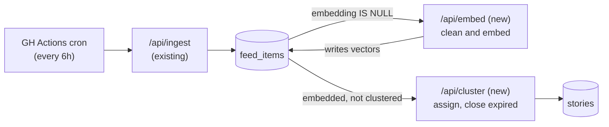
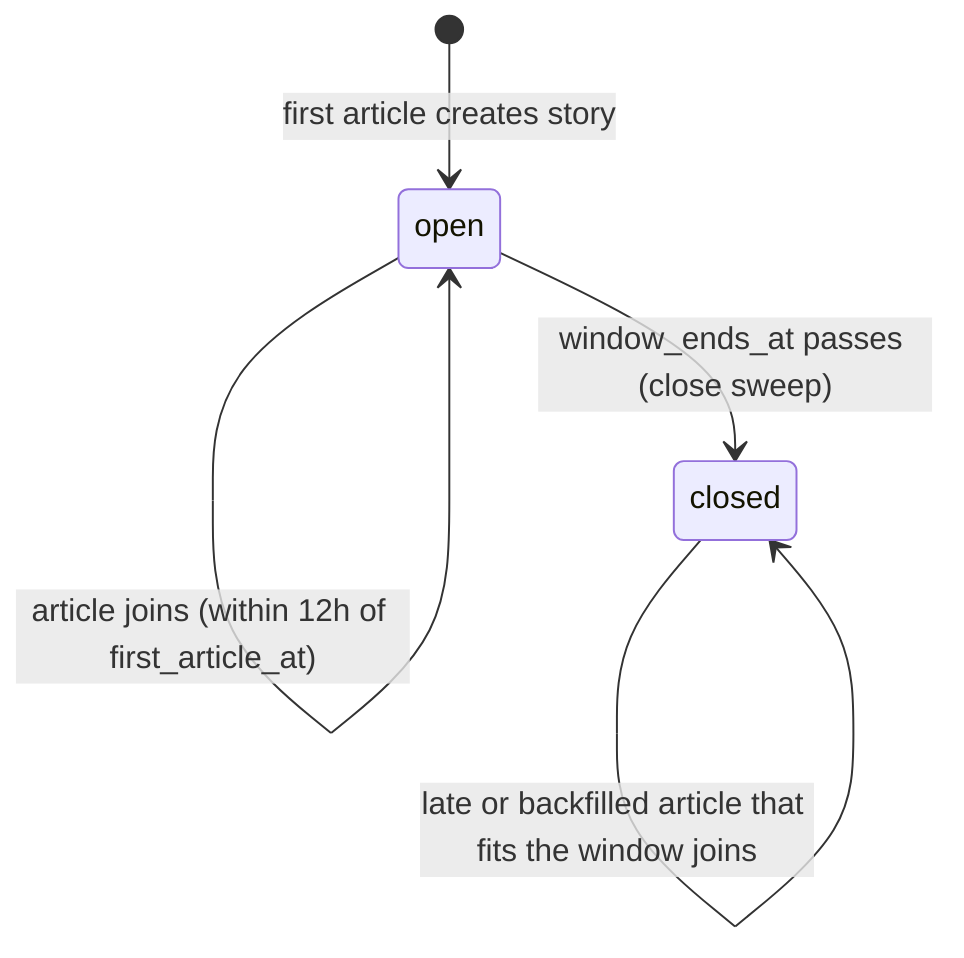
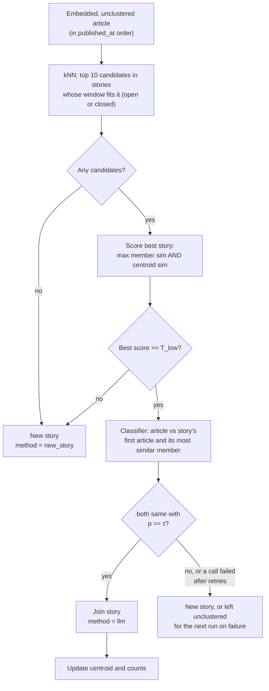
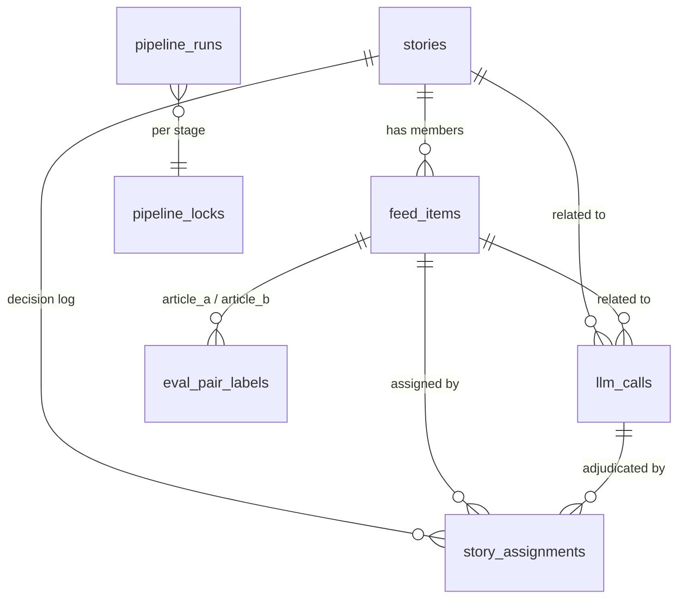

# Story Clustering v1 — TDD

| | |
|---|---|
| **Author** | Claude (Sonnet 5.5; revised by Opus 5.5), with Camrick Solorio |
| **Created** | 2026-09-27 |
| **Updated** | 2026-10-05 |
| **Status** | Ready for review |
| **References** | PRD: None (intent is captured in the TL;DR below) · Plan: [plan.md](plan.md) · Follow-on feature: [story-summary-v1](../story-summary-v1/tdd.md) |

## TL;DR

Better News pulls articles from about 30 outlets into one feed, but today every article is its own card, so the same event shows up a dozen times. This feature groups articles from different outlets about **the same event at one point in time** into a single **story**. It is built and measured on its own first: the goal is to learn how accurately we can group story content, at running costs close to zero, before adding AI-written summaries on top (that is a separate feature, [story-summary-v1](../story-summary-v1/tdd.md)).

Wrongly grouping two different events is what breaks a reader's trust, while showing one event as two cards costs little. So the feature is built for precision: an article joins a story only when we are confident it reports the same event, and otherwise it stands on its own.

### Requirements

- **R1.** Articles from different outlets about the same specific development are grouped into one story.
- **R2.** A story covers one event at one point in time. Follow-ups and reactions are separate stories.
- **R3.** Grouping quality is measurable, and the system meets these bars before it is considered done:
  - Pairwise precision ≥ 0.95 and related-leak ≤ 10% (defined below), confirmed by a person checking a random sample of the groupings the system actually makes.
  - Recall is measured and reported, but has no bar (2026-10-05).
  - Running cost under $0.50/day.
- **R4.** The operator can inspect any story, see why each article was grouped, correct mistakes, and see what the AI calls cost.
- **R5.** Articles from new sources, or from earlier dates, can be added later and join the stories they belong to, without creating duplicate stories.
- **R6.** The operator is told when the pipeline stalls, fails, or falls behind, without reading logs.
- **R7.** Human labels and manual corrections are stored durably and survive a rebuild of the derived data.

### What counts as the same story

This definition (approved 2026-10-05) is used verbatim in labeling and in every model prompt:

> Two articles are the **same story** only if both report the same specific event (the same announcement, incident, ruling, vote, or statement) as their main subject. Follow-ups, reactions, consequences, new developments, and background pieces are **related**, not same. Analysis and opinion pieces about the event are related too. When in doubt, choose related.

- **Same:** different outlets' news reports on that one event.
- **Related, not same:** reactions, consequences, and new developments that follow from it ("markets slide after Fed hike", "White House responds to ruling", "suspect charged" after "shooting at X"); background and explainers; analysis and opinion about the event.
- **Different:** same topic, different event ("Fed hikes" vs "ECB holds"; two separate storms).

Judgments are three-way: `same`, `related`, or `different`. `related` counts as "should not merge" in every measurement. We still record it separately because those pairs are free training and evaluation data for a future layer that links related stories into an evolving event.

### Out of scope

- AI summaries and any change to what readers see. Both belong to [story-summary-v1](../story-summary-v1/tdd.md). Grouping quality is judged through the admin tools.
- Fetching full article text. Everything works from each article's title and RSS description.
- Linking stories into evolving events (designed for, not built).
- Running a backfill or adding sources. The design supports both and the procedure is in [Backfill and adding sources](#backfill-and-adding-sources), but none is planned yet.
- Re-clustering existing stories, for example after switching embedding models.
- Merging two stories that started separately because two outlets broke the same event at the same moment. This lowers recall and is accepted as a known gap for now.

## Design

### Design overview

An ingest, embed, then cluster pipeline: new articles are cleaned and embedded in one stage, and a separate stage assigns each to a story by embedding similarity, with a language model deciding only the ambiguous cases. The stages hand off through `feed_items` and each runs as a small, repeatable batch job on the existing six-hour schedule, so either can fail, be tuned, or be replaced without touching the other. Every decision is logged so it can be explained and measured.



The design has six parts, described in order and specified in [Detailed design](#detailed-design) under the same names.

**1. Orchestration.** Two new endpoints, `/api/embed` and `/api/cluster`, run in that order after ingest. Each is idempotent, batched, and resumable: it handles a bounded amount of work per call and reports how much remains, and the workflow repeats it until nothing remains. This shape exists because the work has to fit inside a serverless function's time limit and must survive being interrupted. Splitting embedding from clustering isolates their failures: a throttled embedding API delays new articles but never blocks clustering of the ones already embedded. The logic lives in a shared library so local scripts reuse it without HTTP. Only one run of an endpoint can be active at a time, and every endpoint has a documented contract. It can also be scoped by source and date range, so new sources or older content can be processed deliberately.

**2. Normalize and embed.** Each article's title and description are cleaned, duplicates of the same link across feeds are collapsed, and the text is turned into an embedding vector. Embeddings are the cheap signal that decides the clear cases, so everything after depends on clean text and a stable embedding model. This is the `/api/embed` stage, and it never touches stories.

**3. Assign to a story.** This is the `/api/cluster` stage: it reads stored vectors and never calls the embedding API. For each embedded, unclustered article, embeddings find the closest stories whose time window fits it. If none is similar enough, the article starts a new story. Otherwise a classifier model decides whether the article reports the same event as the best candidate, by comparing it with that story's first article and with its closest member, and the article joins only when both comparisons say "same" with high confidence. Embeddings never decide a join on their own, because measured similarity can't tell same-event pairs from related ones. A story only accepts articles within a short, fixed time window (12h) of its first article, and live processing stops adding to it once the window passes. A late-arriving, new-source, or backfilled article can still join any story whose window it fits, even a closed one, so adding sources or older content doesn't create duplicate stories. The fixed window and the two-article check keep stories to one event and prevent them from chaining together related articles.

**4. Shared LLM client.** One small client wraps the model providers (Gemini, OpenRouter, OpenAI, and TypeSafe's jev classifier) for embeddings, chat, and classification. It handles retries, timeouts, a circuit breaker, and fallback, caches repeated verdicts, and records every call and its cost, so cost and behavior are visible in one place. It is shared with later features.

**5. Data model.** New columns on `feed_items` and new tables for stories, an append-only decision log, LLM call records, and evaluation labels. Database constraints keep rows in valid states. The decision log and call records are what make a bad grouping explainable, and human labels live in their own tables, apart from data that can be rebuilt. Stories carry no summary fields; [story-summary-v1](../story-summary-v1/tdd.md) adds them.

**6. Evaluation and admin tooling.** A frozen snapshot, a labeled pair set, public news-similarity datasets, and a replay harness measure grouping quality as thresholds and models change. The final precision number comes from a person checking a random sample of the joins the system makes on the snapshot. A protected admin area lets the operator inspect stories, correct mistakes (which become new labeled data), label pairs, see costs, and check pipeline health.

#### Design decisions

| # | Decision | Why | Rejected |
|---|---|---|---|
| D1 | Work from RSS title + description only (2026-09-27) | Keeps cost and complexity near zero; no scraping or paywall handling | Fetching full article text |
| D2 | Follow-ups are separate stories (2026-09-27) | Keeps each story to one event at one time and gives a future event layer clean units to link | Letting stories grow with follow-ups |
| D3 | Admin is gated by a new `ADMIN_SECRET` (2026-09-27) | Simple, fits a single operator | Full user accounts |
| D4 | ~~Analysis and opinion pieces about the development count as the same story (2026-09-27)~~ **Superseded by D31 (2026-10-05)** | They add framing diversity and don't report a new development | Treating them as `related` |
| D5 | Precision over recall; recall has no ship bar (bar dropped 2026-10-05) | Merging two different events hurts trust more than showing one event as two cards, and would corrupt the future event layer. Under-grouping barely affects readers | Optimizing F1 or recall; a recall ≥ 0.80 bar |
| D6 | ~~Embeddings decide clear cases; an LLM sees only the ambiguous middle~~ **Superseded by D32 (2026-10-05)** | Keeps LLM volume and cost low | LLM on every article |
| D7 | A story's window is anchored to its first article (length: D33) | A latest-anchored window lets a story extend itself with follow-ups | Sliding window |
| D8 | A candidate must pass on both max member similarity and centroid similarity | Prevents chaining, where unrelated articles join one small step at a time | A single similarity score |
| D9 | Thin articles (description < 40 chars) never auto-join on embedding alone (now true of every article under D32; thin-article precision is reported separately) | Short text makes embedding scores unreliable | Treating them like other articles |
| D10 | Log every assignment with score, method, and LLM reasoning | A bad cluster must be explainable and become eval data | Logging only outcomes |
| D11 | Build the labeled set and replay harness before tuning | Every change then produces a number | Tuning by inspection |
| D12 | Silver labels use a non-Gemini model | Avoids sharing blind spots with the Gemini models in the pipeline | Same model family |
| D13 | One ~100-line `fetch` client for both providers, no SDK | Both expose OpenAI-compatible endpoints; one thin wrapper is enough | Provider SDKs |
| D14 | No index on `stories.centroid`; add btrees on `stories (status, window_ends_at)` (close sweep) and `(first_article_at, last_article_at)` (window fit) (2026-10-03) | Candidate lookup is a kNN over articles; centroids are only exact-scored on a handful of candidates, and are rewritten on every join, so an index adds write cost with no read benefit | HNSW or IVFFlat on `centroid` |
| D15 | Switch from `db:push` to `db:generate` + `db:migrate` | `push` can't create the `vector` extension and handles an HNSW index awkwardly | Staying on `db:push` |
| D16 | Clustering ships and is measured on its own, before any summaries (2026-10-03) | Tells us how accurate grouping is before LLM summarization adds cost and a second source of error; summaries become a separate feature | One combined feature |
| D17 | Stories carry no summary columns; the summary feature adds its own (2026-10-03) | Keeps this feature's schema and endpoint minimal, and lets summary staleness be derived from member data instead of a flag set during assignment | A `summary_stale` flag maintained by clustering |
| D18 | Candidate stories are chosen by whether the article fits the story's window, not by `status` (2026-10-03) | Lets late-arriving, new-source, and backfilled articles join the story they belong to instead of creating duplicates | Candidates limited to `open` stories |
| D19 | An article earlier than a story's first article may join and move the story's start back, only if every existing member still fits within the window of it (2026-10-03) | Keeps the window span invariant, so stories can't grow by chaining | Always starting a new story; letting the window grow |
| D20 | `/api/cluster` accepts optional `source`, `from`/`to`, and `mode=backfill` (2026-10-03) | New sources and older content run through the same pipeline and decision log, with no second code path | A separate backfill pipeline |
| D21 | Use `gemini-embedding-2` for embeddings (2026-10-03) | In a test on 300 real articles it separated same-story pairs from same-topic, different-event pairs better than `gemini-embedding-001` (AUC 0.974 vs 0.957; hard negatives scoring ≥ 0.80: 20% vs 41%). It is unit-normalized at 768 dims, takes 8,192-token inputs (vs 2,048), is on the free tier, and costs $0.20/1M tokens beyond it (~$0.05/day at our volume). The labeled eval remains the final check | `gemini-embedding-001` (older, unnormalized at 768 dims, needs `task_type` outside the OpenAI-compatible endpoint) |
| D22 | Each endpoint takes a single-flight lease before doing work (2026-10-03) | Overlapping runs (a cron tick plus a manual backfill) could process the same rows. A lease row works through the Supabase pooler and expires on its own if a function dies | Session-level advisory locks (don't survive the transaction-mode pooler); a manual "don't overlap" rule |
| D23 | Explicit timeouts, a retry budget under the function time limit, and a per-run circuit breaker on external calls (2026-10-03) | Prevents a slow or failing provider from burning the whole run or hanging a batch | Defaults and unbounded retries |
| D24 | Row and story states are protected by database `CHECK` constraints, and the decision log is append-only (2026-10-03) | Derived states could otherwise drift into impossible combinations | Enforcing only in application code |
| D25 | A health endpoint and a pipeline-health panel; the workflow fails loudly when something is wrong (2026-10-03) | A cron run once reported success while ingesting nothing; silent failure must not be possible | Reading logs |
| D26 | Human labels and manual decisions are kept in dedicated tables and exported to the repo; embeddings and stories are treated as rebuildable (2026-10-03) | Derived data can be recomputed from `feed_items`; human judgments cannot | Treating all tables alike |
| D27 | Embedding and clustering are separate stages with separate endpoints, handing off through `feed_items` (2026-10-04) | Isolates failures (a throttled embedding API doesn't block clustering), gives each stage its own time budget, lets the algorithm and the embedding input be changed independently, and makes each easier to debug and test | One combined `/api/cluster` |
| D28 | `/api/cluster` does not wait for older, un-embedded articles (2026-10-04) | One stuck article can't block everything. Out-of-order arrival is already handled by the window-fit rule (D18, D19) | Clustering only up to the oldest un-embedded article (strict order) |
| D29 | Embeddings stay on `feed_items`; changing the embedding model is a manual cutover, not built in v1 (2026-10-04) | Keeps one HNSW index and a simple schema. Model switches are rare, and re-clustering is out of scope | A separate embeddings table keyed by article, model, and input version |
| D30 | Pace embedding calls to the free-tier quotas client-side, treat a per-day 429 as a clean end of run, and keep a usage ledger over `llm_calls` (2026-10-05) | Quotas count each input, not each HTTP call; reacting only to 429s would burn retries and trip the breaker. A per-day 429 is not a provider failure and retrying today is pointless. The ledger and 429 `quotaId` answer quota questions without dashboard checks or a Google Cloud credential | Cloud Monitoring API (needs a service-account credential, minutes of delay, no input-level view); reacting to 429s only |
| D31 | Stricter "same story" definition: only reports of the same specific event are `same`; follow-ups, reactions, consequences, background, analysis, and opinion are `related`; when in doubt, `related` (2026-10-05) | Matches the bar the user applied while labeling 94 pairs (16 `same`, 42 `related`); a looser definition led the silver labeler to call `same` on 15 pairs the user judged `related` | The original definition, with opinion and analysis as `same` (D4) |
| D32 | Embeddings only retrieve candidates; a classifier model decides every join, and there is no embedding-only auto-join (2026-10-05) | On the labeled pairs, human `same` and `related` pairs overlap almost completely in similarity (`same` 0.851–0.952, `related` 0.806–0.954), and the best embedding-only precision was 78–83%. Nothing below 0.80 was `same` or `related`, so a floor still cuts most calls | Auto-joining at a high similarity (D6): 0.95 still gave only 69–83% precision |
| D33 | The window is 12h from a story's first article (2026-10-05; was 36h) | A shorter window gives follow-ups less room to look like the original event, and recall has no bar. It is swept at 12/18/24/36h with the classifier in place and stays at 12h unless a longer window keeps precision ≥ 0.95 | 36h. Note: 8 of 16 human `same` pairs are more than 12h apart by feed timestamps, so 12h costs some recall |
| D34 | A join needs `same` against two members of the candidate story, its first article and its most similar member, each above the probability threshold τ; one call when they are the same article (2026-10-05) | Comparing pairs keeps each judgment simple and matches how labels are collected. Checking the first article stops a story drifting away from its original event as it grows | One call showing several story members at once (the earlier design); checking every member (more cost for little gain at ≤ 12h) |
| D35 | The classifier and τ are chosen by a comparison on labeled pairs: `gpt-4o-mini` with the tightened prompt, `gemini-3.5-flash-lite`, and jev (TypeSafe), plus a rule needing two models to agree. τ is the lowest threshold giving ≥ 0.97 precision on development data, leaving margin for the held-out check (2026-10-05) | jev returns a probability with each decision, which suits a precision threshold, and is very cheap; but its calibration is the vendor's claim, so every candidate is measured the same way | Picking a model up front |
| D36 | Public labeled datasets (SemEval-2022 Task 8 English pairs, WCEP event clusters) are used to develop the prompt and threshold; the user's human labels are the reference and win on conflict; they are never the source of the final precision number (2026-10-05) | Gives thousands of development pairs instead of 94, and so replaces most new labeling. Their definitions of "same" differ from ours, so tuning only on them would aim at the wrong bar | `multi_news` (no negatives, and its groups mix in background and follow-ups); developing only on the 94 human pairs; labeling ~200 more pairs |
| D37 | The ship-bar precision is measured by a person checking a random sample of about 150 joins the system makes when replaying the snapshot, reported with a 95% lower confidence bound, alongside the held-out human pairs (2026-10-05) | Precision is a property of the joins the system makes. Stratified pairs over-sample hard cases, and 16 human `same` pairs are too few to show 95%; 0 errors in 60 joins is needed just for a 95% lower bound above 0.95 | Pairwise precision on the stratified pair set alone |

### Detailed design

Platform versions: Next.js 16.3.6 (App Router) with React 19.2.8, Tailwind v4, TypeScript 5, `drizzle-orm` 0.45.x, `drizzle-kit` 0.31.x, `postgres` 3.4.x, Postgres 17.6 on Supabase with `pgvector` 0.8.2, deployed on Vercel Hobby, package manager `pnpm`.

#### 1. Orchestration

- **Endpoints:** `/api/embed` and `/api/cluster`, each authenticated like `/api/ingest` (`Authorization: Bearer $CRON_SECRET`). They share `lib/pipeline/*` and hand off through `feed_items` (D27).
- **Row states, derived from columns:** *ingested* (`embedding IS NULL`), *embedded* (`embedding IS NOT NULL AND clustered_at IS NULL`), *clustered* (`clustered_at IS NOT NULL`). There is no separate status column.
- **Work selection:** `/api/embed` takes ingested rows whose `embed_next_attempt_at` is null or in the past, oldest `published_at` first. `/api/cluster` takes embedded rows whose `embedding_model` equals the configured model, oldest `published_at` first. Neither waits for the other (D28).
- **Contract:** each call caps its work to stay under the function time limit and returns `{ processed, remaining, failed, durationMs }` (see Endpoint contracts below). Selected rows are processed in `published_at` ascending order.
- **Scoping parameters (optional, D20), accepted by both endpoints:** `source=<feed id>` limits work to one source; `from` and `to` (ISO dates) limit it to a `published_at` range; `mode=backfill` lowers concurrency to respect free-tier limits and, for `/api/cluster`, defers the close sweep until `remaining = 0`. With none set, the endpoint runs the scheduled live behavior.
- **Workflow:** the GitHub Actions workflow (`.github/workflows/`, cron `0 */6 * * *`) runs ingest, then `/api/embed`, then `/api/cluster`, each endpoint in a loop until `remaining = 0` (capped at 50 iterations). A `409 busy` ends a loop with a notice instead of failing. Any other non-2xx response fails the job, but the cluster step still runs if the embed step failed (`if: always()`), so already-embedded articles keep flowing. After clustering, a final step calls `/api/health`, and a `503` fails the job so GitHub's failure notification fires (D25). It keeps `curl -sfL`, which follows redirects.
- **Code layout:** core logic in `lib/pipeline/*`, shared by the endpoint and local scripts (backfill, eval replay).
- **Single-flight lease (D22):** at the start of a run, each endpoint takes a lease on its own `pipeline_locks` row (`embed` or `cluster`): `INSERT ... ON CONFLICT (name) DO UPDATE SET locked_until = now() + <lease>, owner = <run id> WHERE pipeline_locks.locked_until < now() RETURNING`. If no row comes back, another run holds it and the endpoint returns `409 { "status": "busy" }` without doing work. The lease is extended after each batch (so it comfortably outlasts one batch) and released at the end; if the function dies, it simply expires. A session-level advisory lock isn't used because the Supabase pooler is in transaction mode.
- **Run record:** every run writes a `pipeline_runs` row (stage, started/finished time, processed, remaining, failed, error) used by the health checks.

**Endpoint contracts.** All endpoints require `Authorization: Bearer $CRON_SECRET` (required in production; open only for local dev when unset, as `/api/ingest` is today) and respond with JSON.

| Endpoint | Params | 200 response | Errors |
|---|---|---|---|
| `GET /api/ingest` (existing) | none | existing ingest summary | `401` bad or missing secret; `500` |
| `GET /api/embed` | optional `source=<feed id>`, `from`, `to` (ISO dates), `mode=backfill` (D20) | `{ processed, remaining, failed, durationMs }`; `failed` counts rows whose batch exhausted its retries this run | same errors as `/api/cluster` |
| `GET /api/cluster` | optional `source=<feed id>`, `from`, `to` (ISO dates), `mode=backfill` (D20) | `{ processed, remaining, failed, durationMs }`. `remaining > 0` means call again, including when the run stopped at its time budget | `400` invalid params `{ error }`; `401` bad or missing secret; `409` `{ status: "busy" }` when the lease is held; `500` `{ error }` |
| `GET /api/health` | none | `{ ok: true, checks: [...] }` when all checks pass | `503 { ok: false, checks: [...] }` when any check fails; `401` |

Each check in `checks` is `{ name, ok, detail }`. The health checks, with starting thresholds:

- **Ingest freshness:** the newest `feed_items.created_at` is under 12h old.
- **Embed freshness:** the last successful `/api/embed` run (from `pipeline_runs`) is under 12h old.
- **Cluster freshness:** the last successful `/api/cluster` run is under 12h old.
- **Backlog:** the oldest unclustered article is under 12h old.
- **Stuck rows:** no rows have `embed_attempts` at or above 5.

Admin pages and actions are Next.js server actions behind `ADMIN_SECRET` (see part 6), not part of this public contract.

#### 2. Normalize and embed

- **`lib/text.ts`:** strips HTML and entities from `summary`, collapses whitespace, and drops boilerplate such as "Continue reading…" and "The post X appeared first on Y".
- **Dedupe:** by `canonical_link` (query and `utm_*` params stripped), so one outlet's article in two feeds (e.g. `nyt-us` and `nyt-business`) counts once.
- **Embedding input:** `"task: clustering | query: " + title + "\n\n" + cleanSummary.slice(0, 1000)`. `gemini-embedding-2` has no `task_type` parameter; the task is set by this text prefix (D21).
- **Model:** `gemini-embedding-2` (D21), 768 dimensions, called through the OpenAI-compatible endpoint with `dimensions: 768`. Verified 2026-10-03 on both the native and OpenAI-compatible endpoints. Vectors come back unit-length at 768 dimensions, so they are stored as returned. Max input is 8,192 tokens, well above our ~1,000-character input. The model ID is stored per row in `feed_items.embedding_model`. Switching models later means re-embedding everything, since the vector spaces are not comparable.
- **Batching:** up to 100 inputs per request; batches of 25 worked reliably under free-tier limits in testing.
- **Source data shape:** the input is only title and RSS description (avg ~680 chars; ~9% empty or under 40 chars).
- **Stage contract (`/api/embed`, D27):** selects ingested rows (see Work selection) up to a per-call cap, builds the input, and calls `embed()` in batches of 25. It writes `embedding`, `embedding_model`, and `embedding_input_version` in one `UPDATE` per batch. When a batch exhausts its retries, its rows get `embed_attempts + 1`, `embed_error`, and `embed_next_attempt_at = now() + min(1h × 2^attempts, 12h)`, and the run moves on. After 5 attempts a row is left out of the queue and surfaced by the stuck-rows health check. It calls only the embedding API and never reads stories.
- **Versioning (D29):** `embedding_input_version` records which text builder and prefix produced a vector (a constant bumped whenever `lib/text.ts` cleaning or the prefix changes). `/api/cluster` only uses rows matching the configured `embedding_model`. A cutover procedure for changing models is not built in v1, since re-clustering is out of scope.

#### 3. Assign to a story

**Time window.** A story is anchored to its earliest article and spans at most **W = 12h** from first to last article (D33; config `windowHours`). An article joins a story only if it fits the window: `last_article_at − W ≤ published_at ≤ first_article_at + W` (D18). In the usual case, a later article, this is the rule "within W of `first_article_at`". The left bound lets a late or backfilled article that is *earlier* than the story's first article join, as long as every existing member still fits within W of it; then `first_article_at` moves back to that article and `window_ends_at` is recalculated (D19). Otherwise it starts its own story. The window never lets a story grow through follow-ups, because the first-to-last span is always ≤ W. 12h favors precision over slow outlets (international, weeklies), whose later reports start their own stories; the sweep in part 6 checks 12, 18, 24, and 36h.

`status` is `open` until the close sweep sees `window_ends_at` in the past, then `closed`. Closed stories stay candidates for articles that fit their window.

**Lifecycle.**



**Per-article flow.**



**Stage contract (`/api/cluster`, D27):** reads stored vectors only and never calls the embedding API; the classifier is called only to decide joins. Because it does not wait for embedding (D28), an older article that embeds late is clustered after newer ones and joins through the window-fit rule.

Articles are processed in `published_at` order.

1. **Candidates:** pgvector kNN (top 10 by cosine similarity) over clustered articles whose story's window fits this article's `published_at` (the rule above), whether the story is `open` or `closed`, using the HNSW index on `feed_items.embedding`.
2. **Score each candidate story** by (a) the article's max similarity to the story's members and (b) its similarity to the story centroid, an exact cosine calculation with no index. It must pass on **both** to join, so a candidate's score is the lower of the two, and the highest-scoring candidate is the one checked against the floor and sent to the classifier. Exact ties (common with wire stories) go to the bigger story, then the older one, then by id, so a run never depends on row order. The implementation is one shared core (`lib/pipeline/assign.ts`) over a store interface, with a database store for `/api/cluster` and an in-memory store for the eval replay harness, so the harness measures the same logic production runs.
3. **Retrieval floor** (D32): if the best candidate's score is below `T_low` (starting value **0.84**; config `tLow`), start a new story. Otherwise the best candidate goes to the classifier. There is no embedding-only join: `tHigh` is removed from the config (or fixed above 1), and `method = "embedding"` is no longer produced. Only the best candidate story is adjudicated; trying the second-best when the first is rejected is a recall lever left for later. Thin articles (description < 40 chars) go through the same path, and their precision is reported separately in eval (D9).
4. **Classifier adjudication** (D34, D35): compare the article pairwise with (a) the story's first article and (b) its member with the highest similarity to the article; when (a) and (b) are the same article, one call. Each call sends both articles' title and cleaned snippet (≤ 1,000 chars) and the "same story" definition above, verbatim. Any examples in the prompt come only from development data, never from the held-out human labels.
   - **Output:** a relation in `same` | `related` | `different` and a probability for `same`. For chat models this is strict JSON `{ "relation", "p_same": 0-1, "reason" }`; for jev, its typed label and calibrated probability.
   - **Join rule:** join only if **both** calls return `same` with `p_same ≥ τ`. τ is set per model and prompt version in config (`adjudicator.model`, `adjudicator.promptVersion`, `adjudicator.tau`), chosen by the comparison in part 6 (D35). Until then the starting value is τ = 0.9.
   - **Rejection:** `related`, `different`, `p_same < τ`, or invalid output starts a new story (`method = "new_story"`, with the verdicts logged).
   - **Failure:** a call that still fails after retries leaves the article unclustered for the next run instead of creating a story, since that would be permanent. The backlog health check catches a long outage.
   - **Model:** chosen in Phase 3 among `gpt-4o-mini` (tightened prompt), `gemini-3.5-flash-lite`, and jev, or two of them that must agree (D35).
5. **On join:** update the centroid (running mean), `last_article_at`, `article_count`, and `source_count`. If the article is earlier than `first_article_at`, also move `first_article_at` back and recompute `window_ends_at` (D19).
6. **Close:** stories whose `window_ends_at` is in the past are set to `closed` by a cheap `UPDATE` in the same endpoint. In backfill mode this runs once at the end.

The design leaves room for the future event layer: stories get no `event_id` column, but closed point-in-time stories, `related` labels, and the `story_assignments` log give it clean inputs.

#### 4. Shared LLM client

`lib/llm.ts`, a small `fetch` wrapper, no SDK. Providers:

| Provider | Used for | Endpoint | Key |
|---|---|---|---|
| `gemini` | embeddings; `gemini-3.5-flash-lite` chat | OpenAI-compatible, `generativelanguage.googleapis.com/v1beta/openai/` (verified) | `GOOGLE_GEMINI_API_KEY` |
| `openrouter` | chat, and same-model fallback | OpenAI-compatible | `OPEN_ROUTER_API_KEY` |
| `openai` | `gpt-4o-mini`: silver labels and an adjudicator candidate | Chat Completions with strict structured outputs | `OPENAI_API_KEY` |
| `jev` | jev (TypeSafe) classifier: an adjudicator candidate | TypeSafe API; the request shape (a typed label schema in, label plus probability out) is confirmed from TypeSafe's docs when the provider is added | `JEV_API_KEY` |

- **API:** `chat({ provider, model, messages, jsonSchema, purpose })`, `embed({ inputs, purpose })`, and an adjudication wrapper `adjudicate({ article, member })` that returns `{ relation, pSame, reason? }` from whichever adjudicator is configured, so the assignment core does not depend on the provider.
- **Resilience:** a 429 is retried with backoff. Chat may fall back to OpenRouter only when it serves the **same model ID**, and the fallback is logged; adjudication never switches to a different model, because τ is calibrated per model (D35). A batch is never dropped silently: it is retried until it succeeds, or its rows are left unprocessed (`embedding` stays null) for the next run.
- **Failure policy (D23), with starting values to tune:**
  - **Timeouts:** 20s per embedding call and 30s per chat call; a database `statement_timeout` of 10s on pipeline queries. An endpoint-wide deadline equals the function's `maxDuration` minus a 10s margin; after it, the run starts no new batches and returns with `remaining`.
  - **Retries:** up to 4 attempts with exponential backoff and jitter (`wait = 1s × 2^attempt ± 50%`), only for idempotent calls (embedding and chat requests are). Total retry time is bounded by the time left before the deadline.
  - **Circuit breaker, per provider and per run:** after 3 consecutive failures (429 or 5xx) that exhaust retries, the breaker opens and further calls to that provider fail fast for the rest of the run. Chat calls fall back to OpenRouter for the same model only; with no such fallback, the cluster run ends early and its articles stay unclustered for the next run. Embedding calls have no fallback, so the embed run ends early and its rows wait for the next run; clustering is unaffected. The breaker resets at the start of each run.
- **Prices (config price table):** `gemini-embedding-2` $0.20 per 1M input tokens; `gemini-3.5-flash-lite` $0.30 per 1M input and $2.50 per 1M output tokens (output includes thinking tokens), both paid standard tier, looked up 2026-10-03 (batch pricing is half); `gpt-4o-mini` $0.15 per 1M input and $0.60 per 1M output (2026-10-05); jev $0.042 per 1M input tokens with output not charged (TypeSafe's launch post, 2026-10-05; confirm on its pricing page when the provider is added).
- **Accounting:** every call writes a row to `llm_calls` (purpose, provider, model, tokens in/out, estimated cost from a price table in config (see below), latency, ok/error, related story/article id).
- **Verdict cache:** keyed on the unordered pair `(article_id, member_id)` plus `(model, prompt_version)`, so eval sweeps and re-runs don't pay twice. Stored on the `llm_calls` row itself (`cache_key`, `response`); the newest successful row with a matching key is a hit.

#### 5. Data model

Changes live in `db/schema.ts`. `pgvector` 0.8.2 is available on our Supabase instance and needs `create extension if not exists vector;` once. Drizzle provides a `vector()` column type and a `cosineDistance()` helper.



```
feed_items  (+ columns)
  embedding        vector(768)
  embedding_model  text
  embedding_input_version text
  embed_attempts   int not null default 0
  embed_error      text
  embed_next_attempt_at timestamptz
  story_id         uuid → stories.id (nullable)
  clustered_at     timestamptz
  canonical_link   text
  HNSW index on embedding (vector_cosine_ops)

stories
  id, created_at, first_article_at, last_article_at
  status               'open' | 'closed'
  window_ends_at       timestamptz        -- first_article_at + window
  centroid             vector(768)
  article_count, source_count
  btree index on (status, window_ends_at)        -- close sweep
  btree index on (first_article_at, last_article_at)  -- window-fit candidate lookup

story_assignments      -- append-only decision log
  id, article_id, story_id, created_at
  method        'embedding' | 'llm' | 'new_story' | 'manual'   -- 'embedding' is no longer produced (D32); kept for old rows
  top_score, centroid_score
  llm_call_id   → llm_calls.id (nullable)
  llm_verdict   jsonb    -- both pairwise verdicts (D34), including on rejection
  pipeline_version text   -- hash of T_low, window, τ, model IDs, and prompt versions

llm_calls
  id, created_at, purpose, provider, model,
  input_tokens, output_tokens, cost_usd, latency_ms, ok, error,
  story_id, article_id,
  cache_key, response   -- verdict cache: a chat call with a cache key stores its parsed response; same key later => no call

eval_pair_labels
  article_a, article_b,
  label 'same' | 'related' | 'different' | 'unsure',
  labeler 'human' | 'model:<id>', note, created_at

pipeline_locks         -- single-flight lease per endpoint
  name (pk), owner, locked_until

pipeline_runs          -- one row per endpoint run, for health checks
  id, stage ('embed' | 'cluster'), started_at, finished_at, processed, remaining, failed, error
```

**Invariants (D24).** Enforced in the database, not only in code:

- `feed_items`: `clustered_at IS NULL OR (embedding IS NOT NULL AND story_id IS NOT NULL)`, and `embedding IS NULL OR (embedding_model IS NOT NULL AND embedding_input_version IS NOT NULL)`.
- `stories`: `status IN ('open', 'closed')`, `first_article_at <= last_article_at`, and `window_ends_at >= last_article_at` (the window always covers the story's last article).
- Status moves `open` to `closed` only, and only through the close sweep; a `closed` story is never set back to `open`. A trigger rejects the reverse transition.
- `story_assignments` is append-only: a trigger rejects `UPDATE` and `DELETE`.

**Durable versus rebuildable data (D26).**

| Kind | Tables | Recovery |
|---|---|---|
| Source of truth | `feed_items` | Can't be re-fetched: feeds only expose their latest items. Depends on the database's own backups |
| Human data, not recomputable | `eval_pair_labels` (human labels and model silver labels), `story_assignments` rows with `method = 'manual'` | Stored only in dedicated tables, never overwritten by a pipeline run. `scripts/export-labels.ts` writes them, keyed by article `guid` rather than internal UUIDs, to `eval/labels-YYYY-MM-DD.jsonl`, committed to the repo after each labeling session; a matching import script restores them |
| Rebuildable | `feed_items` embedding and story columns, `stories`, non-manual `story_assignments`, `llm_calls` | Recomputed from `feed_items` by replaying the pipeline |

The "doesn't belong" admin action writes both a label and a `manual` assignment, so every human correction lands in the durable tier.

**Migrations.** The repo uses `db:push` today with no `drizzle/` migrations folder. The design switches to `db:generate` + `db:migrate`, with a custom SQL migration for `create extension vector` (see D15).

**No centroid index (D14).** The stories that can fit a given article are bounded by the window (at most a few hundred rows), so even a scan is milliseconds. Revisit only if a later merge pass or a centroid-first candidate lookup searches centroids by nearest neighbor.

#### 6. Evaluation and admin tooling

**Clustering eval.**

1. **Snapshot:** `scripts/snapshot.ts` exports ≥ 4 days of `feed_items` and embeddings to `eval/snapshot-YYYY-MM-DD.jsonl`. All tuning runs against a fixed snapshot.
2. **Pair labeling, stratified by similarity:** ~300 pairs across buckets (0.6–0.7, 0.7–0.8, 0.8–0.9, 0.9+), plus pairs the pipeline merged. Likely `related` pairs are deliberately oversampled (same-topic pairs published 12–48h apart), because random pairs would be ~99% `different`.
3. **Silver labels, then human verification:** a non-Gemini model labels all pairs: OpenAI `gpt-4o-mini`, called directly through its Chat Completions API with strict structured outputs. A human reviews every silver-vs-pipeline disagreement plus a random ~50 others, to measure the silver labeler's reliability. Human labels always win. Silver labels made with the original definition are re-made with the D31 definition before they are used again. If `gpt-4o-mini` also becomes the adjudicator, silver labels are no longer independent of it (D12), so they are used only as development data in that case.
4. **Public datasets (D36):** converted to the same pair format (title plus the first 1,000 characters of text, to resemble an RSS snippet) under `eval/public/` (gitignored, rebuilt by a script):
   - **SemEval-2022 Task 8**, English–English pairs. Articles are distributed as URLs and fetched by script; pairs whose articles can't be fetched are dropped. The "overall" similarity score maps to `same` at the most-similar end and to `related` or `different` below it; the cut points are set by checking a sample against the D31 definition.
   - **WCEP**, the editor-cited articles only (not the automatically added ones). Pairs of articles from different events on the same day and in the same category are `different` (hard negatives); pairs within one event are candidate `same`, used only after a spot check, because editors also cite background pieces.
   - Each source is reported separately and never mixed into the human-label numbers.
5. **Data splits:** development = public pairs plus the 206 pairs that have only silver labels; reference = the 94 human-labeled pairs, used to check that a candidate prompt and τ match the user's bar, and never used for prompt examples.
6. **Classifier comparison (D35):** each candidate adjudicator runs on the development and reference pairs (through the verdict cache, so re-runs are free). For each, report a precision-versus-τ curve and the recall at the τ giving ≥ 0.97 development precision, plus thin-article precision. Every run's cost is estimated and approved before it is made.
7. **Replay harness:** `pnpm eval:cluster --snapshot … --t-low … --window-hours … --adjudicator … --tau …` replays the snapshot through the shared assignment core with the real classifier (cached) and reports:
   - Pairwise precision / recall / F1, with `related` counted as a negative, on the labeled pairs
   - Related-leak rate: the share of `related` pairs wrongly merged
   - Share of articles reaching the classifier, classifier calls, and $ per 100 articles
   - The worst false merges and false splits, with titles
8. **Sweep** `T_low` (0.80–0.88), τ, and the window (12, 18, 24, 36h); keep the cheapest config that meets the bar in R3, preferring 12h (D33).
9. **Join audit (D37):** from the chosen config's replay, draw a random sample of ~150 joins (an article and the story member it was judged against), label them in the labeling UI as their own queue, and report precision with an exact 95% lower confidence bound. The bar is a point estimate ≥ 0.95. For the lower bound to clear 0.95 as well, a 150-join sample can have at most 2 errors. Audited joins are stored in `eval_pair_labels` like any human label.

**Admin UI** (`/admin`, gated by `ADMIN_SECRET`).

- **Auth:** a `proxy.ts` check (Next 16 renamed Middleware to Proxy) redirects to a sign-in page that sets an httpOnly cookie. Because the Next docs say Proxy shouldn't be the only authorization layer, every admin server action and API route also re-checks the secret. `ADMIN_SECRET` is added to `.env.example`, the local `.env`, and Vercel project env.
- **Stories inspector:** open and closed stories with members, per-member score and method, and LLM reasoning. A "doesn't belong" action records a label (`related` or `different`) and a `manual` reassignment, so production mistakes become eval data.
- **Labeling queue:** side-by-side pairs, keyboard shortcuts `s` / `r` / `d` / `u`, with the "same story" definition pinned at the top. Queues: review, unlabeled, all, and the join audit (D37).
- **Cost panel:** `llm_calls` by day × purpose × model.
- **Pipeline health panel (D25):** per stage, the last run's time, status, processed, and failed counts; row counts by state (ingested without an embedding, embedded but unclustered, clustered); the age of the oldest unprocessed article; the number of stuck rows (5 or more failed embed attempts); the number of open stories; and 429 and fallback counts from `llm_calls`. It shows the same checks as `/api/health`.

## Risks

### Unknowns to investigate

| Unknown | What would settle it |
|---|---|
| Whether the `task: clustering \| query:` prefix helps `gemini-embedding-2` | Format confirmed in Google's docs (2026-10-05). The with/without comparison runs on the labeled pairs (`pnpm eval:prefix`; the alternatives are no prefix and `task: sentence similarity \| query:`) |
| Real share of articles that reach the classifier | The replay harness's classifier share. A first measurement on the conservative baseline: 48.5% at `T_low` 0.84 / 12h and 31.8% at 0.88 / 12h; with up to two calls per article that is roughly 650–1,000 calls/day. Re-measure with the classifier in place, since joins then shrink the number of new stories |
| ~~Whether embedding thresholds alone can meet the bar~~ | **Settled 2026-10-06: they cannot.** On 300 labeled pairs (94 human, rest silver), `T_high` 0.88 gave precision 61.7% / recall 93.5% / related-leak 50.8%, and the best precision seen was 78–83% at recall 8–36%. Human `same` and `related` pairs overlap almost completely in similarity (median 0.909 vs 0.896), while everything below 0.8 is `different`. Outcome: D32 |
| Whether the 12h window costs precision or only recall (D33) | 8 of 16 human `same` pairs are more than 12h apart by feed timestamps (max 32h), and the sample was drawn from a 36h window. Check those 8 pairs for timestamp errors (reposts, time zones), then run the window sweep with the classifier in place |
| Which adjudicator, prompt, and τ reach ≥ 0.95 precision, and at what recall (D35) | The classifier comparison in part 6. If no single model gets there with useful recall, try the two-model agreement rule |
| Whether jev's probabilities are calibrated on our task, and its API shape | Its calibration is a vendor claim. Read TypeSafe's API docs when adding the provider; check calibration with the precision-versus-τ curve on development and reference pairs |
| Whether public datasets transfer to our definition and input (D36) | Their "same" is looser or differently defined, they are full articles cut to snippets, and SemEval URLs may be dead. Measured 2026-10-05 for WCEP: after junk filtering, about 75% of `same` pairs are clean, 20% borderline (reactions, follow-ups), 5% wrong; its per-article times are unreliable, so it cannot test the 12h window. The Internet Archive rate-limits bulk SemEval page fetches. Spot-check a sample of converted pairs against D31, and compare each candidate's results on public pairs with its results on the human reference pairs. If they disagree, the human labels win and that source is dropped from development |
| Whether ~150 audited joins are enough | An exact binomial bound needs at most 2 errors in 150 for a 95% lower bound above 0.95 (0 errors in 60 at the minimum). If the audit lands between, extend the sample rather than declaring the bar met |
| ~~Whether the window-filtered kNN stays accurate and fast on a large backfilled history~~ | **Settled 2026-10-05.** At 100k rows over 100 days, default HNSW returned 3.3 of 10 rows (recall 0.33) because the window filter runs after the index search; `hnsw.iterative_scan = relaxed_order` gives recall 0.99 at ~10 ms, and is now set per candidate query in `store-db.ts` |
| What backups the Supabase plan provides for `feed_items` (the source of truth that feeds can't re-supply) | Checked 2026-10-04: the free plan has no downloadable or point-in-time backups, so a periodic `feed_items` export is needed (where it is stored is undecided) |
| ~~Whether the AI Studio free-tier request limits cover our volume~~ | **Settled 2026-10-05: they do not for `gemini-embedding-2`.** Limits are 100 requests/min, 30k tokens/min and 1,000 requests/day, and each input in a batch counts as one request (a probe of one 100-input call used the whole per-minute quota; the first per-day 429 arrived after 900 inputs / 36 HTTP requests). So the cap is ~1,000 articles a day, about our entire daily volume, and the ~7,500-row backlog would take a week. Still open: the `gemini-3.5-flash-lite` limits |

### Technical risks

| Risk | Impact | Mitigation |
|---|---|---|
| **Stricter definition is a harder problem.** Separating `same` from `related` is hard for embeddings and models, since related articles share vocabulary and the line is ambiguous even for a person | False merges, the failure mode we care most about | A classifier decides every join (D32) against two story members (D34), a τ chosen for ≥ 0.97 development precision (D35), a short window (D33), the related-leak metric, and a join audit (D37) |
| **Prompt and threshold overfit** to development data | Precision on live data falls below what eval showed | Reference labels are never used for examples; the τ margin (0.97 on development data); the join audit on a replay of the snapshot (D37); "doesn't belong" corrections in production are tracked as an ongoing precision check |
| **A new vendor** (TypeSafe, jev) for the adjudicator | An outage, a price change, or a model update shifts results | A failed call leaves articles unclustered rather than creating stories; no switch to an uncalibrated model; τ is tied to model and prompt version in config, so a model change requires re-running the comparison |
| **Snippet quality.** ~9% of articles are thin | Too little text for the classifier to tell same from related | No embedding-only joins (D9, D32); thin-article precision is reported separately, and if it falls short, thin articles start their own story |
| **Promo and advertorial articles** (e.g. sportsbook bonus-code posts from different outlets) score ~0.85–0.87 against each other | They form fake stories | Add a noise filter or exclusion rule before or during normalization; check how many appear in the labeled snapshot |
| **Split-at-birth stories.** No merge pass, so two outlets breaking an event simultaneously create two stories | Lower recall | Measured by recall; a later pass over open stories' centroids that reuses adjudication can fix it |
| **Free-tier rate limits** on AI Studio (embeddings: 100 inputs/min, 1,000 inputs/day) | The daily cap equals our daily volume, so any retry or busy day leaves a backlog, and the backfill takes ~7 days | Client-side pacing to 90% of the per-minute limits, per-day 429s end the run cleanly (D30), a usage ledger and `embed-quota` health check warn at 80% of the cap, and the paid tier (~$0.05/day at our volume) is the fix. Backoff and OpenRouter fallback cover chat |
| **kNN slot dominance.** Candidates come from the K = 10 most similar *member articles*, then are grouped by story (2026-10-05) | One large story can fill all 10 slots and hide a smaller story that fits as well, so the best candidate is missed and a duplicate story is created | Raise K (30–50) or take the top few members per story; add a K control to the explorer and compare on labeled pairs before choosing |
| **Out-of-order clustering.** Embedding lag means an older article can be clustered after newer ones (D28) | Extra late appends and, in the worst case, a few more ambiguous decisions | The window-fit rule handles it (D18, D19); track how often articles cluster out of order in the eval and health data |
| **Stuck rows.** An article that always fails to embed (for example empty text) | It never gets clustered | Attempt cap with backoff, a stuck-rows health check, and the admin panel count |
| **A lease that expires mid-run** (D22) | Two runs process the same rows | The lease is extended after every batch and is longer than one batch; writes are idempotent, so a rare overlap duplicates work but not results |
| **Function time limit** on Vercel Hobby | A batch could be cut off mid-run | Batched, resumable, idempotent endpoints (part 1) |
| **Late appends change closed stories** (D18) | A closed story's members, and any summary, change after it closed | Appends are logged in `story_assignments`; the summary feature derives staleness from members and re-summarizes ([story-summary-v1](../story-summary-v1/tdd.md) D7) |
| **A backfill hits free-tier caps** | A long or failed run | `mode=backfill` throttles; the endpoint is resumable; OpenRouter fallback; run in date ranges |
| **Free-tier prompts may be used for training** | Article text sent to Google | Acceptable: it is public news content |

### Scale, latency, and cost

Designed for about 1,000 new articles/day across 31 feeds (measured: 950–1,240 ingested per day, 2026-09-29 to 2026-10-02). Latency isn't user-facing: processing runs on the six-hour cron and nothing reader-facing depends on it in v1. Hard limits are the serverless function time limit (handled by batching) and free-tier request caps (handled by backoff and fallback). Open stories are bounded to a few hundred rows by the 12h window, so candidate scoring stays cheap. Volumes much beyond this haven't been evaluated, and kNN cost, LLM-band volume, and cost would need re-checking first.

Estimated steady-state cost at paid prices for ~1,000 articles/day. Assumes ~30–50% of articles clear `T_low` and up to two pairwise calls each (~650–1,000 calls/day), ~600 input tokens per call (definition, instructions, two snippets) and ~80 output tokens for chat models. These are estimates until real `llm_calls` data exists; thinking tokens could raise flash-lite's output cost:

| Step | Volume/day | Est. cost/day |
|---|---|---|
| Embeddings (`gemini-embedding-2`, $0.20/1M tokens) | ~250k tokens (~1,000 articles × ~250 tokens) | ~$0.05 |
| Adjudication with jev | ~0.4–0.6M input tokens | ~$0.02–0.03 |
| Adjudication with `gpt-4o-mini` | ~0.4–0.6M input, ~50–80k output tokens | ~$0.09–0.14 |
| Adjudication with `gemini-3.5-flash-lite` | ~0.4–0.6M input, ~50–80k output tokens | ~$0.25–0.38 |
| **Total** | | **≈ $0.07–0.43/day**, depending on the adjudicator; two-model agreement adds the second model's cost |
| One-time silver labeling (actual) | 300 pairs | $0.03 |
| One-time classifier comparison | ~2,000 development and reference pairs per candidate | ~$0.05 (jev), ~$0.30 (`gpt-4o-mini`), ~$0.75 (flash-lite) |

A backfill costs roughly linearly in article count. Per 10,000 articles that is about 2.5M embedding tokens and roughly 6,500–10,000 adjudication calls. Dollar cost is small; free-tier daily caps are the likelier limit, so large backfills run over several days in date ranges.

Summary costs are tracked in [story-summary-v1](../story-summary-v1/tdd.md#scale-latency-and-cost).

## Open questions

None open. Answered:

- **Q1. What exactly counts as the same story?** Answered 2026-10-05: the stricter wording in [What counts as the same story](#what-counts-as-the-same-story) (D31).
- **Q2. Are analysis and opinion pieces about an event the same story?** Answered 2026-09-27 as yes (D4); reversed 2026-10-05: they are `related` (D31).
- **Q3. What is the ship bar?** Answered 2026-09-27 as precision ≥ 0.95, recall ≥ 0.80, related-leak ≤ 10%; changed 2026-10-05: precision ≥ 0.95 confirmed by a join audit, related-leak ≤ 10%, recall reported with no bar (D5, D37).
- **Q4. How long is a story's window?** Answered 2026-09-27 as 36h; changed 2026-10-05 to 12h, subject to the sweep (D33).
- **Q5. May public labeled datasets be used?** Answered 2026-10-05: yes, for development only (D36).
- The split into a clustering-first feature (D16) and the product decisions D1–D3 stand.

## Backfill and adding sources

How to add content beyond the scheduled live run. Nothing here is planned yet; it documents how the design supports it (D18–D20).

### Adding a new source

1. Add `{ id, label, url }` to `feeds.config.ts` and deploy. Check the feed's XML parses with `lib/rss.ts`.
2. Run ingest (or wait for the next cron tick). The feed's latest items land in `feed_items` with `embedding` and `clustered_at` null.
3. The next scheduled `/api/embed` run embeds them and `/api/cluster` then assigns them. Items older than the window join closed stories they fit; the rest join open stories or start new ones. No extra steps.

### Backfilling older content

1. **Load the articles into `feed_items`.** Feeds only expose their latest items, so history needs another source (an archive, export, or sitemap). Insert with the normal upsert by `guid`, with `published_at` set correctly and `embedding` and `clustered_at` null. How history is sourced is outside this design.
2. **Try a small slice first.** Pick one day, run step 4 for just that range, and inspect the results in the stories inspector: which stories gained members, the `method` for each assignment, and any new stories that look like duplicates.
3. **Overlap is safe.** If the scheduled run holds the lease, the call returns `409 busy` (D22); wait and call again.
4. **Run the backfill, oldest range first:**

   ```bash
   curl -s "$APP_URL/api/embed?mode=backfill&from=2026-08-01&to=2026-08-08" \
     -H "Authorization: Bearer $CRON_SECRET"
   curl -s "$APP_URL/api/cluster?mode=backfill&from=2026-08-01&to=2026-08-08" \
     -H "Authorization: Bearer $CRON_SECRET"
   ```

   Repeat each call until `remaining = 0`, embedding first, then clustering. Use `source=<feed id>` to limit it to one source. Items are processed oldest-first, and the close sweep runs once at the end.
5. **Check the run.** Look at the cost panel for spend, `llm_calls` for 429s and OpenRouter fallbacks, and spot-check late appends in the stories inspector. Fix mistakes with the "doesn't belong" action (`manual` assignment).
6. **Continue with the next range.** If the summary feature is live, run `/api/summarize` afterward so stories whose members changed are re-summarized.

There is no bulk undo. Because assignments are an append-only log, mistakes are corrected by `manual` reassignment, which is why the first run is a small slice.
