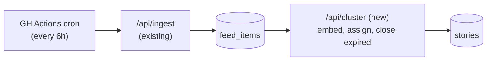
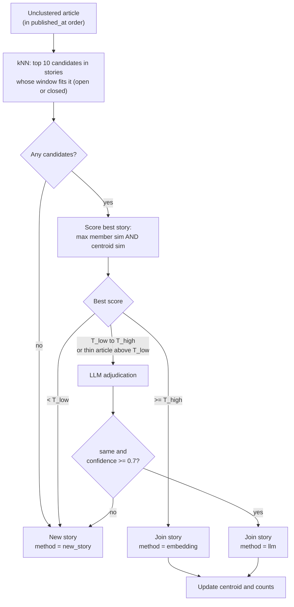
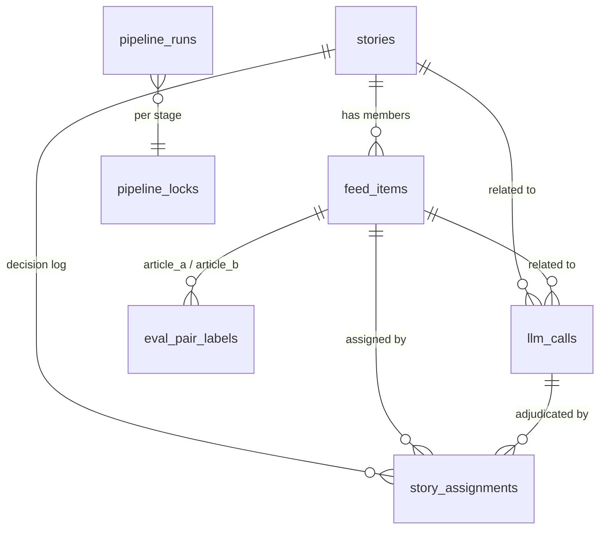

# Story Clustering v1 — TDD

| | |
|---|---|
| **Author** | Claude (Sonnet 5.5), with Camrick Solorio |
| **Created** | 2026-09-27 |
| **Updated** | 2026-10-03 |
| **Status** | Ready for review |
| **References** | PRD: None (intent is captured in the TL;DR below) · Plan: [plan.md](plan.md) · Follow-on feature: [story-summary-v1](../story-summary-v1/tdd.md) |

## TL;DR

Better News pulls articles from about 30 outlets into one feed, but today every article is its own card, so the same event shows up a dozen times. This feature groups articles from different outlets about **the same event at one point in time** into a single **story**. It is built and measured on its own first: the goal is to learn how accurately we can group story content, at running costs close to zero, before adding AI-written summaries on top (that is a separate feature, [story-summary-v1](../story-summary-v1/tdd.md)).

### Requirements

- **R1.** Articles from different outlets about the same specific development are grouped into one story.
- **R2.** A story covers one event at one point in time. Follow-ups and reactions are separate stories.
- **R3.** Grouping quality is measurable, and the system meets these bars before it is considered done:
  - Pairwise precision ≥ 0.95, recall ≥ 0.80, and related-leak ≤ 10% (defined below).
  - Running cost under $0.50/day.
- **R4.** The operator can inspect any story, see why each article was grouped, correct mistakes, and see what the AI calls cost.
- **R5.** Articles from new sources, or from earlier dates, can be added later and join the stories they belong to, without creating duplicate stories.
- **R6.** The operator is told when the pipeline stalls, fails, or falls behind, without reading logs.
- **R7.** Human labels and manual corrections are stored durably and survive a rebuild of the derived data.

### What counts as the same story

Two articles are the **same story** if their main subject is the **same specific development**: the same announcement, incident, ruling, vote, release, or statement, reported around the same time.

- **Same:** different outlets' news reports on that development, and analysis or opinion pieces whose main subject is that development. These add framing diversity and don't report something new.
- **Related, not same:** reactions, consequences, and new developments that follow from it ("markets slide after Fed hike", "White House responds to ruling", "suspect charged" after "shooting at X").
- **Different:** same topic, different development ("Fed hikes" vs "ECB holds"; two separate storms).

Judgments are three-way: `same`, `related`, or `different`. `related` counts as "should not merge" in every measurement. We still record it separately because those pairs are free training and evaluation data for a future layer that links related stories into an evolving event.

### Out of scope

- AI summaries and any change to what readers see. Both belong to [story-summary-v1](../story-summary-v1/tdd.md). Grouping quality is judged through the admin tools.
- Fetching full article text. Everything works from each article's title and RSS description.
- Linking stories into evolving events (designed for, not built).
- Running a backfill or adding sources. The design supports both and the procedure is in [Backfill and adding sources](#backfill-and-adding-sources), but none is planned yet.
- Re-clustering existing stories, for example after switching embedding models.
- Merging two stories that started separately because two outlets broke the same event at the same moment. This lowers recall and is accepted as a known gap for now.

## Design

### Design overview

An ingest-then-process pipeline: new articles are cleaned and embedded, and each is assigned to a story by embedding similarity, with a language model deciding only the ambiguous cases. The step runs as a small, repeatable batch job on the existing six-hour schedule, and every decision is logged so it can be explained and measured.



The design has six parts, described in order and specified in [Detailed design](#detailed-design) under the same names.

**1. Orchestration.** A new endpoint, `/api/cluster`, runs after ingest. It is idempotent, batched, and resumable: it handles a bounded amount of work per call and reports how much remains, and the workflow repeats it until nothing remains. This shape exists because the work has to fit inside a serverless function's time limit and must survive being interrupted. The logic lives in a shared library so local scripts reuse it without HTTP. Only one run of an endpoint can be active at a time, and every endpoint has a documented contract. It can also be scoped by source and date range, so new sources or older content can be processed deliberately.

**2. Normalize and embed.** Each article's title and description are cleaned, duplicates of the same link across feeds are collapsed, and the text is turned into an embedding vector. Embeddings are the cheap signal that decides the clear cases, so everything after depends on clean text and a stable embedding model.

**3. Assign to a story.** For each new article, find the closest open stories, then decide by similarity: very high joins, very low starts a new story, and the middle band goes to a language model. A story only accepts articles that fit a fixed time window around its first article, and live processing stops adding to it once the window passes. A late-arriving, new-source, or backfilled article can still join any story whose window it fits, even a closed one, so adding sources or older content doesn't create duplicate stories. The two-signal check and the fixed window exist to keep stories to one event and prevent them from chaining together unrelated articles.

**4. Shared LLM client.** One small client wraps both model providers (Gemini and OpenRouter) for embeddings and chat. It handles retries, timeouts, a circuit breaker, and fallback, caches repeated verdicts, and records every call and its cost, so cost and behavior are visible in one place. It is shared with later features.

**5. Data model.** New columns on `feed_items` and new tables for stories, an append-only decision log, LLM call records, and evaluation labels. Database constraints keep rows in valid states. The decision log and call records are what make a bad grouping explainable, and human labels live in their own tables, apart from data that can be rebuilt. Stories carry no summary fields; [story-summary-v1](../story-summary-v1/tdd.md) adds them.

**6. Evaluation and admin tooling.** A frozen snapshot, a labeled pair set, and a replay harness measure grouping quality as thresholds change. A protected admin area lets the operator inspect stories, correct mistakes (which become new labeled data), label pairs, see costs, and check pipeline health.

#### Design decisions

| # | Decision | Why | Rejected |
|---|---|---|---|
| D1 | Work from RSS title + description only (2026-09-27) | Keeps cost and complexity near zero; no scraping or paywall handling | Fetching full article text |
| D2 | Follow-ups are separate stories (2026-09-27) | Keeps each story to one event at one time and gives a future event layer clean units to link | Letting stories grow with follow-ups |
| D3 | Admin is gated by a new `ADMIN_SECRET` (2026-09-27) | Simple, fits a single operator | Full user accounts |
| D4 | Analysis and opinion pieces about the development count as the same story (2026-09-27) | They add framing diversity and don't report a new development | Treating them as `related` |
| D5 | Precision over recall | Merging two different events hurts trust more than showing one event as two cards, and would corrupt the future event layer | Optimizing F1 or recall |
| D6 | Embeddings decide clear cases; an LLM sees only the ambiguous middle | Keeps LLM volume and cost low | LLM on every article |
| D7 | A story's window is anchored to its first article (36h, tuned in eval) | A latest-anchored window lets a story extend itself with follow-ups | Sliding window |
| D8 | A candidate must pass on both max member similarity and centroid similarity | Prevents chaining, where unrelated articles join one small step at a time | A single similarity score |
| D9 | Thin articles (description < 40 chars) never auto-join on embedding alone | Short text makes embedding scores unreliable | Treating them like other articles |
| D10 | Log every assignment with score, method, and LLM reasoning | A bad cluster must be explainable and become eval data | Logging only outcomes |
| D11 | Build the labeled set and replay harness before tuning | Every change then produces a number | Tuning by inspection |
| D12 | Silver labels use a non-Gemini model | Avoids sharing blind spots with the Gemini models in the pipeline | Same model family |
| D13 | One ~100-line `fetch` client for both providers, no SDK | Both expose OpenAI-compatible endpoints; one thin wrapper is enough | Provider SDKs |
| D14 | No index on `stories.centroid`; add btrees on `stories (status, window_ends_at)` (close sweep) and `(first_article_at, last_article_at)` (window fit) (2026-10-03) | Candidate lookup is a kNN over articles; centroids are only exact-scored on a handful of candidates, and are rewritten on every join, so an index adds write cost with no read benefit | HNSW or IVFFlat on `centroid` |
| D15 | Switch from `db:push` to `db:generate` + `db:migrate` | `push` can't create the `vector` extension and handles an HNSW index awkwardly | Staying on `db:push` |
| D16 | Clustering ships and is measured on its own, before any summaries (2026-10-03) | Tells us how accurate grouping is before LLM summarization adds cost and a second source of error; summaries become a separate feature | One combined feature |
| D17 | Stories carry no summary columns; the summary feature adds its own (2026-10-03) | Keeps this feature's schema and endpoint minimal, and lets summary staleness be derived from member data instead of a flag set during assignment | A `summary_stale` flag maintained by clustering |
| D18 | Candidate stories are chosen by whether the article fits the story's window, not by `status` (2026-10-03) | Lets late-arriving, new-source, and backfilled articles join the story they belong to instead of creating duplicates | Candidates limited to `open` stories |
| D19 | An article earlier than a story's first article may join and move the story's start back, only if every existing member still fits within 36h of it (2026-10-03) | Keeps the 36h span invariant, so stories can't grow by chaining | Always starting a new story; letting the window grow |
| D20 | `/api/cluster` accepts optional `source`, `from`/`to`, and `mode=backfill` (2026-10-03) | New sources and older content run through the same pipeline and decision log, with no second code path | A separate backfill pipeline |
| D21 | Use `gemini-embedding-2` for embeddings (2026-10-03) | In a test on 300 real articles it separated same-story pairs from same-topic, different-event pairs better than `gemini-embedding-001` (AUC 0.974 vs 0.957; hard negatives scoring ≥ 0.80: 20% vs 41%). It is unit-normalized at 768 dims, takes 8,192-token inputs (vs 2,048), is on the free tier, and costs $0.20/1M tokens beyond it (~$0.05/day at our volume). The labeled eval remains the final check | `gemini-embedding-001` (older, unnormalized at 768 dims, needs `task_type` outside the OpenAI-compatible endpoint) |
| D22 | Each endpoint takes a single-flight lease before doing work (2026-10-03) | Overlapping runs (a cron tick plus a manual backfill) could process the same rows. A lease row works through the Supabase pooler and expires on its own if a function dies | Session-level advisory locks (don't survive the transaction-mode pooler); a manual "don't overlap" rule |
| D23 | Explicit timeouts, a retry budget under the function time limit, and a per-run circuit breaker on external calls (2026-10-03) | Prevents a slow or failing provider from burning the whole run or hanging a batch | Defaults and unbounded retries |
| D24 | Row and story states are protected by database `CHECK` constraints, and the decision log is append-only (2026-10-03) | Derived states could otherwise drift into impossible combinations | Enforcing only in application code |
| D25 | A health endpoint and a pipeline-health panel; the workflow fails loudly when something is wrong (2026-10-03) | A cron run once reported success while ingesting nothing; silent failure must not be possible | Reading logs |
| D26 | Human labels and manual decisions are kept in dedicated tables and exported to the repo; embeddings and stories are treated as rebuildable (2026-10-03) | Derived data can be recomputed from `feed_items`; human judgments cannot | Treating all tables alike |

### Detailed design

Platform versions: Next.js 16.3.6 (App Router) with React 19.2.8, Tailwind v4, TypeScript 5, `drizzle-orm` 0.45.x, `drizzle-kit` 0.31.x, `postgres` 3.4.x, Postgres 17.6 on Supabase with `pgvector` 0.8.2, deployed on Vercel Hobby, package manager `pnpm`.

#### 1. Orchestration

- **Endpoint:** `/api/cluster`, authenticated like `/api/ingest` (`Authorization: Bearer $CRON_SECRET`).
- **Work selection:** rows with `clustered_at IS NULL`.
- **Contract:** each call caps its work to stay under the function time limit and returns `{ processed, remaining, failed, durationMs }` (see Endpoint contracts below). Selected rows are processed in `published_at` ascending order.
- **Scoping parameters (optional, D20):** `source=<feed id>` limits work to one source; `from` and `to` (ISO dates) limit it to a `published_at` range; `mode=backfill` lowers concurrency to respect free-tier limits and defers the close sweep until `remaining = 0`. With none set, the endpoint runs the scheduled live behavior.
- **Workflow:** the GitHub Actions workflow (`.github/workflows/`, cron `0 */6 * * *`) calls the endpoint in a loop until `remaining = 0` (capped at 50 iterations). A `409 busy` ends the loop with a notice instead of failing. Any other non-2xx response fails the job. After clustering, a final step calls `/api/health`, and a `503` fails the job so GitHub's failure notification fires (D25). It keeps `curl -sfL`, which follows redirects.
- **Code layout:** core logic in `lib/pipeline/*`, shared by the endpoint and local scripts (backfill, eval replay).
- **Single-flight lease (D22):** at the start of a run, the endpoint takes a lease on its `pipeline_locks` row: `INSERT ... ON CONFLICT (name) DO UPDATE SET locked_until = now() + <lease>, owner = <run id> WHERE pipeline_locks.locked_until < now() RETURNING`. If no row comes back, another run holds it and the endpoint returns `409 { "status": "busy" }` without doing work. The lease is extended after each batch (so it comfortably outlasts one batch) and released at the end; if the function dies, it simply expires. A session-level advisory lock isn't used because the Supabase pooler is in transaction mode.
- **Run record:** every run writes a `pipeline_runs` row (stage, started/finished time, processed, remaining, failed, error) used by the health checks.

**Endpoint contracts.** All endpoints require `Authorization: Bearer $CRON_SECRET` (required in production; open only for local dev when unset, as `/api/ingest` is today) and respond with JSON.

| Endpoint | Params | 200 response | Errors |
|---|---|---|---|
| `GET /api/ingest` (existing) | none | existing ingest summary | `401` bad or missing secret; `500` |
| `GET /api/cluster` | optional `source=<feed id>`, `from`, `to` (ISO dates), `mode=backfill` (D20) | `{ processed, remaining, failed, durationMs }`. `remaining > 0` means call again, including when the run stopped at its time budget | `400` invalid params `{ error }`; `401` bad or missing secret; `409` `{ status: "busy" }` when the lease is held; `500` `{ error }` |
| `GET /api/health` | none | `{ ok: true, checks: [...] }` when all checks pass | `503 { ok: false, checks: [...] }` when any check fails; `401` |

Each check in `checks` is `{ name, ok, detail }`. The health checks, with starting thresholds:

- **Ingest freshness:** the newest `feed_items.created_at` is under 12h old.
- **Backlog:** the oldest unclustered article is under 12h old.
- **Cluster freshness:** the last successful `/api/cluster` run (from `pipeline_runs`) is under 12h old.

Admin pages and actions are Next.js server actions behind `ADMIN_SECRET` (see part 6), not part of this public contract.

#### 2. Normalize and embed

- **`lib/text.ts`:** strips HTML and entities from `summary`, collapses whitespace, and drops boilerplate such as "Continue reading…" and "The post X appeared first on Y".
- **Dedupe:** by `canonical_link` (query and `utm_*` params stripped), so one outlet's article in two feeds (e.g. `nyt-us` and `nyt-business`) counts once.
- **Embedding input:** `"task: clustering | query: " + title + "\n\n" + cleanSummary.slice(0, 1000)`. `gemini-embedding-2` has no `task_type` parameter; the task is set by this text prefix (D21).
- **Model:** `gemini-embedding-2` (D21), 768 dimensions, called through the OpenAI-compatible endpoint with `dimensions: 768`. Verified 2026-10-03 on both the native and OpenAI-compatible endpoints. Vectors come back unit-length at 768 dimensions, so they are stored as returned. Max input is 8,192 tokens, well above our ~1,000-character input. The model ID is stored per row in `feed_items.embedding_model`. Switching models later means re-embedding everything, since the vector spaces are not comparable.
- **Batching:** up to 100 inputs per request; batches of 25 worked reliably under free-tier limits in testing.
- **Source data shape:** the input is only title and RSS description (avg ~680 chars; ~9% empty or under 40 chars).

#### 3. Assign to a story

**Time window.** A story is anchored to its earliest article and spans at most **36h** from first to last article. An article joins a story only if it fits the window: `last_article_at − 36h ≤ published_at ≤ first_article_at + 36h` (D18). In the usual case, a later article, this is the rule "within 36h of `first_article_at`". The left bound lets a late or backfilled article that is *earlier* than the story's first article join, as long as every existing member still fits within 36h of it; then `first_article_at` moves back to that article and `window_ends_at` is recalculated (D19). Otherwise it starts its own story. The window never lets a story grow through follow-ups, because the first-to-last span is always ≤ 36h. 36h is a starting value tuned in eval: long enough for slow outlets (international, weeklies), short enough that next-day coverage falls outside.

`status` is `open` until the close sweep sees `window_ends_at` in the past, then `closed`. Closed stories stay candidates for articles that fit their window.

**Lifecycle.**


**Per-article flow.**



Articles are processed in `published_at` order.

1. **Candidates:** pgvector kNN (top 10 by cosine similarity) over clustered articles whose story's window fits this article's `published_at` (the rule above), whether the story is `open` or `closed`, using the HNSW index on `feed_items.embedding`.
2. **Score each candidate story** by (a) the article's max similarity to the story's members and (b) its similarity to the story centroid, an exact cosine calculation with no index. It must pass on **both** to join.
3. **Decide by band** (starting thresholds, tuned in eval):

   | Best score | Action |
   |---|---|
   | ≥ `T_high` (~0.88) | auto-join, `method = "embedding"` |
   | `T_low`–`T_high` (~0.75–0.88) | LLM adjudication |
   | < `T_low` | new story |

   **Thin articles** (description < 40 chars) never auto-join on embedding score alone. Anything above `T_low` goes to the LLM.
4. **LLM adjudication:** send the new article's title and snippet plus the story's 3 members closest to the centroid, along with the "same story" definition (above, verbatim). The prompt calls out the related-vs-same line explicitly. Output is structured JSON: `{ "relation": "same"|"related"|"different", "confidence": 0-1, "reason": string }`. Join only on `same` with `confidence ≥ 0.7`. Model: `gemini-3.5-flash-lite` (verified working 2026-09-27).
5. **On join:** update the centroid (running mean), `last_article_at`, `article_count`, and `source_count`. If the article is earlier than `first_article_at`, also move `first_article_at` back and recompute `window_ends_at` (D19).
6. **Close:** stories whose `window_ends_at` is in the past are set to `closed` by a cheap `UPDATE` in the same endpoint. In backfill mode this runs once at the end.

The design leaves room for the future event layer: stories get no `event_id` column, but closed point-in-time stories, `related` labels, and the `story_assignments` log give it clean inputs.

#### 4. Shared LLM client

`lib/llm.ts`, a `fetch` wrapper of roughly 100 lines, no SDK. Both providers expose OpenAI-compatible endpoints: OpenRouter natively, and Gemini at `generativelanguage.googleapis.com/v1beta/openai/` (verified).

- **API:** `chat({ provider, model, messages, jsonSchema, purpose })` and `embed({ inputs, purpose })`.
- **Resilience:** a 429 is treated as normal on the Gemini free tier: back off, then fall back to OpenRouter for chat, and log the fallback. A batch is never dropped silently: it is retried until it succeeds, or its rows are left unprocessed (`clustered_at` stays null) for the next run.
- **Failure policy (D23), with starting values to tune:**
  - **Timeouts:** 20s per embedding call and 30s per chat call; a database `statement_timeout` of 10s on pipeline queries. An endpoint-wide deadline equals the function's `maxDuration` minus a 10s margin; after it, the run starts no new batches and returns with `remaining`.
  - **Retries:** up to 4 attempts with exponential backoff and jitter (`wait = 1s × 2^attempt ± 50%`), only for idempotent calls (embedding and chat requests are). Total retry time is bounded by the time left before the deadline.
  - **Circuit breaker, per provider and per run:** after 3 consecutive failures (429 or 5xx) that exhaust retries, the breaker opens and further calls to that provider fail fast for the rest of the run. Chat calls fall back to OpenRouter. Embedding calls have no fallback, so the run ends early and its rows wait for the next run. The breaker resets at the start of each run.
- **Prices (config price table; paid standard tier, looked up 2026-10-03; free tier is $0):** `gemini-embedding-2` $0.20 per 1M input tokens; `gemini-3.5-flash-lite` $0.30 per 1M input and $2.50 per 1M output tokens (output includes thinking tokens). Batch pricing for both is half the standard rate.
- **Accounting:** every call writes a row to `llm_calls` (purpose, provider, model, tokens in/out, estimated cost from a price table in config (see below), latency, ok/error, related story/article id).
- **Verdict cache:** keyed on `(article_id, story_member_ids, model, prompt_version)`, so eval sweeps and re-runs don't pay twice.

#### 5. Data model

Changes live in `db/schema.ts`. `pgvector` 0.8.2 is available on our Supabase instance and needs `create extension if not exists vector;` once. Drizzle provides a `vector()` column type and a `cosineDistance()` helper.



```
feed_items  (+ columns)
  embedding        vector(768)
  embedding_model  text
  story_id         uuid → stories.id (nullable)
  clustered_at     timestamptz
  canonical_link   text
  HNSW index on embedding (vector_cosine_ops)

stories
  id, created_at, first_article_at, last_article_at
  status               'open' | 'closed'
  window_ends_at       timestamptz        -- first_article_at + window
  centroid             vector(768)
  article_count, source_count
  btree index on (status, window_ends_at)        -- close sweep
  btree index on (first_article_at, last_article_at)  -- window-fit candidate lookup

story_assignments      -- append-only decision log
  id, article_id, story_id, created_at
  method        'embedding' | 'llm' | 'new_story' | 'manual'
  top_score, centroid_score
  llm_call_id   → llm_calls.id (nullable)
  llm_verdict   jsonb
  pipeline_version text   -- hash of thresholds + model IDs + prompt versions

llm_calls
  id, created_at, purpose, provider, model,
  input_tokens, output_tokens, cost_usd, latency_ms, ok, error,
  story_id, article_id

eval_pair_labels
  article_a, article_b,
  label 'same' | 'related' | 'different' | 'unsure',
  labeler 'human' | 'model:<id>', note, created_at

pipeline_locks         -- single-flight lease per endpoint
  name (pk), owner, locked_until

pipeline_runs          -- one row per endpoint run, for health checks
  id, stage, started_at, finished_at, processed, remaining, failed, error
```

**Invariants (D24).** Enforced in the database, not only in code:

- `feed_items`: `clustered_at IS NULL OR (embedding IS NOT NULL AND story_id IS NOT NULL)`, and `embedding IS NULL OR embedding_model IS NOT NULL`.
- `stories`: `status IN ('open', 'closed')`, `first_article_at <= last_article_at`, and `window_ends_at >= last_article_at` (the window always covers the story's last article).
- Status moves `open` to `closed` only, and only through the close sweep; a `closed` story is never set back to `open`. A trigger rejects the reverse transition.
- `story_assignments` is append-only: a trigger rejects `UPDATE` and `DELETE`.

**Durable versus rebuildable data (D26).**

| Kind | Tables | Recovery |
|---|---|---|
| Source of truth | `feed_items` | Can't be re-fetched: feeds only expose their latest items. Depends on the database's own backups |
| Human data, not recomputable | `eval_pair_labels` (human labels and model silver labels), `story_assignments` rows with `method = 'manual'` | Stored only in dedicated tables, never overwritten by a pipeline run. `scripts/export-labels.ts` writes them, keyed by article `guid` rather than internal UUIDs, to `eval/labels-YYYY-MM-DD.jsonl`, committed to the repo after each labeling session; a matching import script restores them |
| Rebuildable | `feed_items` embedding and story columns, `stories`, non-manual `story_assignments`, `llm_calls` | Recomputed from `feed_items` by replaying the pipeline |

The "doesn't belong" admin action writes both a label and a `manual` assignment, so every human correction lands in the durable tier.

**Migrations.** The repo uses `db:push` today with no `drizzle/` migrations folder. The design switches to `db:generate` + `db:migrate`, with a custom SQL migration for `create extension vector` (see D15).

**No centroid index (D14).** The stories that can fit a given article are bounded by the 36h window (a few hundred rows), so even a scan is milliseconds. Revisit only if a later merge pass or a centroid-first candidate lookup searches centroids by nearest neighbor.

#### 6. Evaluation and admin tooling

**Clustering eval.**

1. **Snapshot:** `scripts/snapshot.ts` exports ≥ 4 days of `feed_items` and embeddings to `eval/snapshot-YYYY-MM-DD.jsonl`. All tuning runs against a fixed snapshot.
2. **Pair labeling, stratified by similarity:** ~300 pairs across buckets (0.6–0.7, 0.7–0.8, 0.8–0.9, 0.9+), plus pairs the pipeline merged. Likely `related` pairs are deliberately oversampled (same-topic pairs published 12–48h apart), because random pairs would be ~99% `different`.
3. **Silver labels, then human verification:** a strong non-Gemini model via OpenRouter labels all pairs (about $1–3 once). A human reviews every silver-vs-pipeline disagreement plus a random ~50 others, to measure the silver labeler's reliability. Human labels always win. Budget about 1–2 hours of human time.
4. **Replay harness:** `pnpm eval:cluster --snapshot … --t-high … --t-low … --window-hours …` reports:
   - Pairwise precision / recall / F1 (headline), with `related` counted as a negative
   - Related-leak rate: the share of `related` pairs wrongly merged
   - Share of articles reaching the LLM band, LLM calls, and $ per 100 articles
   - The worst false merges and false splits, with titles
5. **Sweep** thresholds and window, and pick the cheapest config that meets the bar in R3.

**Admin UI** (`/admin`, gated by `ADMIN_SECRET`).

- **Auth:** a `proxy.ts` check (Next 16 renamed Middleware to Proxy) redirects to a sign-in page that sets an httpOnly cookie. Because the Next docs say Proxy shouldn't be the only authorization layer, every admin server action and API route also re-checks the secret. `ADMIN_SECRET` is added to `.env.example`, the local `.env`, and Vercel project env.
- **Stories inspector:** open and closed stories with members, per-member score and method, and LLM reasoning. A "doesn't belong" action records a label (`related` or `different`) and a `manual` reassignment, so production mistakes become eval data.
- **Labeling queue:** side-by-side pairs, keyboard shortcuts `s` / `r` / `d` / `u`, with the "same story" definition pinned at the top.
- **Cost panel:** `llm_calls` by day × purpose × model.
- **Pipeline health panel (D25):** per stage, the last run's time, status, processed, and failed counts; row counts by state (ingested without an embedding, embedded but unclustered, clustered); the age of the oldest unprocessed article; the number of open stories; and 429 and fallback counts from `llm_calls`. It shows the same checks as `/api/health`.

## Risks

### Unknowns to investigate

| Unknown | What would settle it |
|---|---|
| Whether the `task: clustering \| query:` prefix helps `gemini-embedding-2` | Confirm the exact format against Google's docs, then compare with and without the prefix on the labeled snapshot |
| Real share of articles that land in the LLM band | The replay harness's LLM-band percentage. The estimate is ~20–35% (~200–350 short calls/day at ~1,000 articles/day) and the strict definition may push it higher |
| Whether the starting 36h window and `T_low`/`T_high` thresholds meet the bar | Sweep on the frozen snapshot. In a one-day test, `T_high` ≈ 0.88 admitted a few different-event pairs, while same-story pairs mostly scored ≥ 0.92 |
| Whether the window-filtered kNN stays accurate and fast on a large backfilled history | Test pgvector 0.8 iterative index scans (`hnsw.iterative_scan`) on a large sample before any backfill; if needed, restrict by `published_at` range first |
| What backups the Supabase plan provides for `feed_items` (the source of truth that feeds can't re-supply) | Check the plan's backup and point-in-time recovery options; if limited, add a periodic export of `feed_items` |
| Whether the AI Studio free-tier request limits cover our volume (~1,000 embeds and ~200–350 adjudication calls/day) | Look up the limits for `gemini-embedding-2` and `gemini-3.5-flash-lite`, then compare with measured usage in `llm_calls`; the fallback is OpenRouter or the paid tier |

### Technical risks

| Risk | Impact | Mitigation |
|---|---|---|
| **Stricter definition is a harder problem.** Separating `same` from `related` is hard for embeddings and LLMs, since related articles share vocabulary | False merges, the failure mode we care most about | Anchored time window, three-way LLM output, the related-leak metric, oversampling related pairs in eval |
| **Snippet quality.** ~9% of articles are thin | Unreliable embedding scores for those articles | They never auto-join on embedding alone (D9) |
| **Promo and advertorial articles** (e.g. sportsbook bonus-code posts from different outlets) score ~0.85–0.87 against each other | They form fake stories | Add a noise filter or exclusion rule before or during normalization; check how many appear in the labeled snapshot |
| **Split-at-birth stories.** No merge pass, so two outlets breaking an event simultaneously create two stories | Lower recall | Measured by recall; a later pass over open stories' centroids that reuses adjudication can fix it |
| **Free-tier rate limits** on AI Studio | Throttled or failed calls | Backoff, small batches, OpenRouter fallback logged in `llm_calls` |
| **A lease that expires mid-run** (D22) | Two runs process the same rows | The lease is extended after every batch and is longer than one batch; writes are idempotent, so a rare overlap duplicates work but not results |
| **Function time limit** on Vercel Hobby | A batch could be cut off mid-run | Batched, resumable, idempotent endpoint (part 1) |
| **Late appends change closed stories** (D18) | A closed story's members, and any summary, change after it closed | Appends are logged in `story_assignments`; the summary feature derives staleness from members and re-summarizes ([story-summary-v1](../story-summary-v1/tdd.md) D7) |
| **A backfill hits free-tier caps** | A long or failed run | `mode=backfill` throttles; the endpoint is resumable; OpenRouter fallback; run in date ranges |
| **Free-tier prompts may be used for training** | Article text sent to Google | Acceptable: it is public news content |

### Scale, latency, and cost

Designed for about 1,000 new articles/day across 31 feeds (measured: 950–1,240 ingested per day, 2026-09-29 to 2026-10-02). Latency isn't user-facing: processing runs on the six-hour cron and nothing reader-facing depends on it in v1. Hard limits are the serverless function time limit (handled by batching) and free-tier request caps (handled by backoff and fallback). Open stories are bounded to a few hundred rows by the 36h window, so candidate scoring stays cheap. Volumes much beyond this haven't been evaluated, and kNN cost, LLM-band volume, and cost would need re-checking first.

Estimated steady-state cost at the paid standard prices above (the free tier is $0), for ~1,000 articles/day. The 20–35% LLM-band share and the output size per adjudication call are estimates until real `llm_calls` data exists, and thinking tokens could raise the output cost:

| Step | Volume/day | Est. cost/day |
|---|---|---|
| Embeddings (`gemini-embedding-2`, $0.20/1M tokens) | ~250k tokens (~1,000 articles × ~250 tokens) | ~$0.05 (free tier: $0) |
| Gray-zone adjudication (`gemini-3.5-flash-lite`) | ~200–350 calls × ~1k input tokens, ~100–200 output tokens | ~$0.11–0.28 (free tier: $0) |
| **Total** | | **≈ $0.16–0.33/day** (free tier: $0) |
| One-time silver labeling | ~300 pairs | ~$1–3 |

A backfill costs roughly linearly in article count. Per 10,000 articles that is about 2.5M embedding tokens and, at the 20–35% LLM-band estimate, about 2,500–3,500 adjudication calls. Dollar cost is small; free-tier daily caps are the likelier limit, so large backfills run over several days in date ranges.

Summary costs are tracked in [story-summary-v1](../story-summary-v1/tdd.md#scale-latency-and-cost).

## Open questions

None. The product decisions (D1–D4) are answered, along with the default choices for the 36h window and the ship-bar numbers (confirmed 2026-09-27), and the split into a clustering-first feature (D16).

## Backfill and adding sources

How to add content beyond the scheduled live run. Nothing here is planned yet; it documents how the design supports it (D18–D20).

### Adding a new source

1. Add `{ id, label, url }` to `feeds.config.ts` and deploy. Check the feed's XML parses with `lib/rss.ts`.
2. Run ingest (or wait for the next cron tick). The feed's latest items land in `feed_items` with `clustered_at` null.
3. The next scheduled `/api/cluster` run processes them. Items older than 36h join closed stories they fit; the rest join open stories or start new ones. No extra steps.

### Backfilling older content

1. **Load the articles into `feed_items`.** Feeds only expose their latest items, so history needs another source (an archive, export, or sitemap). Insert with the normal upsert by `guid`, with `published_at` set correctly and `clustered_at` null. How history is sourced is outside this design.
2. **Try a small slice first.** Pick one day, run step 4 for just that range, and inspect the results in the stories inspector: which stories gained members, the `method` for each assignment, and any new stories that look like duplicates.
3. **Overlap is safe.** If the scheduled run holds the lease, the call returns `409 busy` (D22); wait and call again.
4. **Run the backfill, oldest range first:**

   ```bash
   curl -s "$APP_URL/api/cluster?mode=backfill&from=2026-08-01&to=2026-08-08" \
     -H "Authorization: Bearer $CRON_SECRET"
   ```

   Repeat the call until `remaining = 0`. Use `source=<feed id>` to limit it to one source. Items are processed oldest-first, and the close sweep runs once at the end.
5. **Check the run.** Look at the cost panel for spend, `llm_calls` for 429s and OpenRouter fallbacks, and spot-check late appends in the stories inspector. Fix mistakes with the "doesn't belong" action (`manual` assignment).
6. **Continue with the next range.** If the summary feature is live, run `/api/summarize` afterward so stories whose members changed are re-summarized.

There is no bulk undo. Because assignments are an append-only log, mistakes are corrected by `manual` reassignment, which is why the first run is a small slice.
