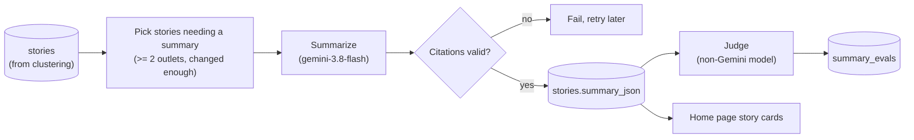
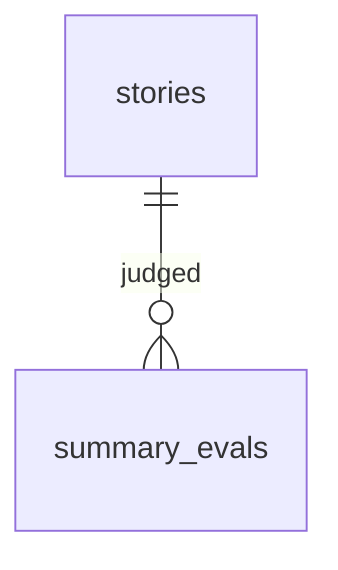

# Story Summary v1 — TDD

| | |
|---|---|
| **Author** | Claude (Sonnet 5.5), with Camrick Solorio |
| **Created** | 2026-10-03 |
| **Updated** | 2026-10-03 |
| **Status** | Ready for review |
| **References** | PRD: None (intent is captured in the TL;DR below) · Plan: [plan.md](plan.md) · Depends on: [story-clustering-v1](../story-clustering-v1/tdd.md) |

## TL;DR

Once articles are grouped into stories (see [story-clustering-v1](../story-clustering-v1/tdd.md)), this feature puts a short, neutral, source-cited AI summary on top of every story that has coverage from at least two outlets, and shows stories to readers as cards. A reader sees the gist of an event in a few sentences, can check every claim against the articles it cites, and sees how outlets' framing differs. It is built after clustering, so grouping quality is known before any AI summarization is added.

### Requirements

- **R1.** A story with at least two distinct outlets gets a short, neutral summary. Every sentence cites the articles it comes from.
- **R2.** The summary notes how specific outlets' framing or emphasis differs.
- **R3.** Summary quality is measurable, and the system meets these bars before it ships:
  - Zero unsupported claims on at least 95% of summaries.
  - Total running cost, including clustering, under $0.50/day.
- **R4.** The home page shows story cards (headline, summary, outlet chips, article count), with single-outlet articles shown alongside.
- **R5.** The operator can see each story's summary, its citations, and its quality scores in the admin tools.

### Out of scope

- Left/center/right lean labels. Outlets are compared by name.
- Fetching full article text. Summaries work from each article's title and RSS description.
- Any change to how stories are formed. That belongs to [story-clustering-v1](../story-clustering-v1/tdd.md).

## Design

### Design overview

A summarizer runs after clustering on the same six-hour schedule. It finds stories that need a (new) summary, sends the member articles' snippets to a language model, validates the structured, cited output in code, and stores it on the story. An automated judge scores every new summary, and the home page reads the stored summaries directly.



The design has five parts, described in order and specified in [Detailed design](#detailed-design) under the same names.

**1. Summarize.** Which stories get a summary, when one is regenerated, what the model sees, and what it must return. Summaries exist only for stories with at least two outlets because the point is comparing coverage, and they are regenerated only on meaningful change to keep cost and churn down. Output is structured and every sentence must cite, so unsupported text can be detected and rejected in code instead of trusted.

**2. Orchestration.** A new endpoint, `/api/summarize`, runs after `/api/cluster` as an idempotent, batched, resumable job, matching how clustering runs. This keeps the work inside a serverless function's time limit and safe to interrupt.

**3. Data model.** Summary columns on `stories` and a new `summary_evals` table for judge scores. Whether a summary is stale is derived from the story's current members, not a flag set during clustering, so clustering stays unaware of summaries.

**4. Evaluation.** An automated judge from a different model family checks every sentence against its cited snippets and scores faithfulness, coverage, and neutrality. A small human spot check calibrates it.

**5. Admin and reader UI.** The admin stories inspector gains the summary, linked citations, and judge scores. The home page, a server component that reads straight from the database, shows story cards with singletons alongside.

#### Design decisions

| # | Decision | Why | Rejected |
|---|---|---|---|
| D1 | A summarized story needs ≥ 2 distinct outlets (2026-09-27) | The point is comparing outlets; a single-outlet "summary" adds nothing | Summarizing every story |
| D2 | No left/center/right lean labels (2026-09-27) | Out of scope; `coverage_notes` compares outlets by name instead | Lean labeling |
| D3 | Summaries use RSS title + description only (2026-09-27) | Keeps cost and complexity near zero; no scraping or paywall handling | Fetching full article text |
| D4 | Every sentence must cite; validation is done in code | Makes unsupported text detectable and rejectable instead of trusted | Trusting the model to cite |
| D5 | Re-summarize only when a new outlet joins or article count grows ≥ 30%; one final pass when the story closes, then freeze unless a late article joins it | Limits cost and summary churn | Re-summarizing on every join |
| D6 | The judge is a non-Gemini model | Avoids sharing blind spots with the Gemini summarizer | Same model family |
| D7 | Staleness is derived from `summary_member_ids` versus current members (2026-10-03) | Clustering no longer sets a `summary_stale` flag, so clustering stays independent of summaries | A flag maintained during clustering |
| D8 | Summary columns are added by this feature's own migration (2026-10-03) | Clustering v1 ships and is measured first with a minimal schema | Adding them in clustering v1 |
| D9 | Reuse the shared LLM client and `llm_calls` from clustering v1 | One place for retries, fallback, caching, and cost accounting | A second client |
| D10 | Summarizer model IDs live in config | Eval can A/B models without code changes | Hardcoded models |

### Detailed design

Platform versions are as in [story-clustering-v1](../story-clustering-v1/tdd.md#detailed-design): Next.js 16.3.6, React 19.2.8, `drizzle-orm` 0.45.x, Postgres 17.6 on Supabase, Vercel Hobby, `pnpm`.

#### 1. Summarize

- **When a story is picked:** it has ≥ 2 distinct outlets (`source_count ≥ 2`) and either has no summary yet, or its current members differ from `summary_member_ids` by a new outlet or by article count grown ≥ 30%. When a story closes, one final pass runs if its members changed since the last summary, then the summary is frozen. A late or backfilled article that later joins a closed story (see [story-clustering-v1](../story-clustering-v1/tdd.md) D18) makes it stale again by the same rule, so it is re-summarized.
- **Model:** `gemini-3.8-flash` via AI Studio (verified working 2026-09-27), with OpenRouter as fallback and comparison. Model IDs live in config. Paid standard price (looked up 2026-10-03; free tier is $0): $0.75 input / $3.75 output per 1M tokens through 2026-12-31, then $1.50 / $7.50 from 2027-01-01. Batch is 50% off.
- **Input:** per article, `[n] Outlet — Title — cleaned snippet`, using the cleaned text from clustering's `lib/text.ts`.
- **Output** (structured JSON, schema-validated):

  ```json
  {
    "headline": "neutral, ≤ 90 chars",
    "summary": [{ "text": "one sentence", "citations": [1, 3] }],
    "coverage_notes": [{ "text": "how outlets' framing or emphasis differs", "citations": [2] }]
  }
  ```

- **Validation:** every sentence must cite articles. Uncited sentences are dropped, and the whole summary fails if it cites a nonexistent article.
- **Prompt rules:** use only the provided text; no outside facts; attribute contested claims ("Fox reports…"); neutral headline; 3–5 sentences, short and unpadded because inputs are snippets.
- **`coverage_notes`** compares specific outlets by name.

#### 2. Orchestration

- **Endpoint:** `/api/summarize`, authenticated like `/api/ingest` (`Authorization: Bearer $CRON_SECRET`).
- **Work selection:** stories matching the picking rules in part 1.
- **Contract:** each call caps its work to stay under the function time limit and returns `{ processed, remaining }`.
- **Workflow:** the existing GitHub Actions workflow calls it, after `/api/cluster`, in a loop until `remaining = 0`.
- **Code layout:** core logic in `lib/pipeline/*`, shared with local scripts.

#### 3. Data model

Added through a `db:generate` migration.

```
stories  (+ columns)
  headline            text
  summary_json        jsonb
  summary_model       text
  summarized_at       timestamptz
  summary_member_ids  uuid[]     -- membership at summary time

summary_evals
  story_id, summarized_at, judge_model,
  faithfulness, coverage, neutrality (1–5), unsupported_claims jsonb
```



#### 4. Evaluation

- **Automated judge** (OpenRouter, non-Gemini family): checks each sentence against its cited snippets and scores faithfulness, coverage, and neutrality (1–5), listing unsupported claims. It runs on every new summary and writes to `summary_evals`.
- **Human spot check:** ~20 summaries per model or prompt change.
- **Ship bar:** zero unsupported claims on ≥ 95% of summaries.

#### 5. Admin and reader UI

- **Admin stories inspector** (extends the one from clustering v1): shows the summary with linked citations and the judge scores. Gated by `ADMIN_SECRET` like the rest of `/admin`.
- **Home page** (`app/page.tsx`, a server component reading from the database): story cards with headline, summary, outlet chips, and article count, with singletons (articles not in a summarized story) alongside.

## Risks

### Unknowns to investigate

| Unknown | What would settle it |
|---|---|
| How many stories per day actually have ≥ 2 outlets | Count them from the first clustering runs; replaces the assumed ~130/day and drives summary and judge cost |
| Price of the judge model on OpenRouter | Look it up and fill the config price table; replaces the placeholder judge cost below |
| Whether snippet-only inputs are enough for faithful, useful summaries | The judge scores and a human spot check on ~50 stories |
| Which judge model is reliable enough | Compare the judge's verdicts to the human spot check |

### Technical risks

| Risk | Impact | Mitigation |
|---|---|---|
| **Thin or empty snippets** give the model little to summarize | Padded or unsupported sentences | Short output rules, mandatory citations, and validation in code; the judge catches the rest |
| **Cluster errors flow into summaries** | A summary blends two different events | Clustering must meet its ship bar first; the inspector lets the operator correct a story |
| **Cost bar at risk on the paid tier.** `gemini-3.8-flash` is $0.75 input / $3.75 output per 1M tokens through 2026-12-31 and doubles to $1.50 / $7.50 on 2027-01-01 | Combined cost is 2–5x over the $0.50/day bar on the paid tier (see below), and the judge is paid on OpenRouter even while Gemini calls are free | Stay on the free tier where possible; use batch pricing (50% off) since summarization is cron-driven, not interactive; cut regenerations (D5 debounce); revisit the model choice before the 2027 price change |
| **Free-tier rate limits** on AI Studio | Throttled or failed calls | Backoff, small batches, OpenRouter fallback logged in `llm_calls` |
| **Function time limit** on Vercel Hobby | A batch could be cut off mid-run | Batched, resumable, idempotent endpoint (part 2) |

### Scale, latency, and cost

Designed for roughly 130 summarized stories/day from ~1,000 articles/day. That story count is an assumption (the earlier 40-from-300 estimate scaled linearly); the real number of stories with ≥ 2 outlets is unknown until clustering runs. Summarization runs on the six-hour cron, so latency isn't user-facing; the home page reads stored summaries. Hard limits are the function time limit and free-tier request caps, handled as above. Volumes much beyond this haven't been evaluated.

Estimated steady-state cost at the paid standard prices (the Gemini free tier is $0; the judge on OpenRouter is paid either way). Output sizes are estimates until real `llm_calls` data exists:

| Step | Volume/day | Est. cost/day |
|---|---|---|
| Summaries (`gemini-3.8-flash`) | ~260 regens × ~3k input, ~400 output tokens | ~$0.98 through 2026-12-31; ~$1.95 from 2027-01-01 (free tier: $0) |
| Summary judge | ~260 calls × ~3k tokens | ~$0.15–0.45 (placeholder until the judge model's price is looked up) |
| **Summary total** | | **≈ $1.10–1.45/day now; ≈ $2.10–2.40/day from 2027** |
| Clustering ([story-clustering-v1](../story-clustering-v1/tdd.md#scale-latency-and-cost)) | | ≈ $0.16–0.33/day |
| **Combined** | | **≈ $1.30–1.80/day now; ≈ $2.30–2.70/day from 2027** (paid tier; the judge is the only paid part on the free tier) |

## Open questions

None. The summary decisions (D1–D3) were answered 2026-09-27.
